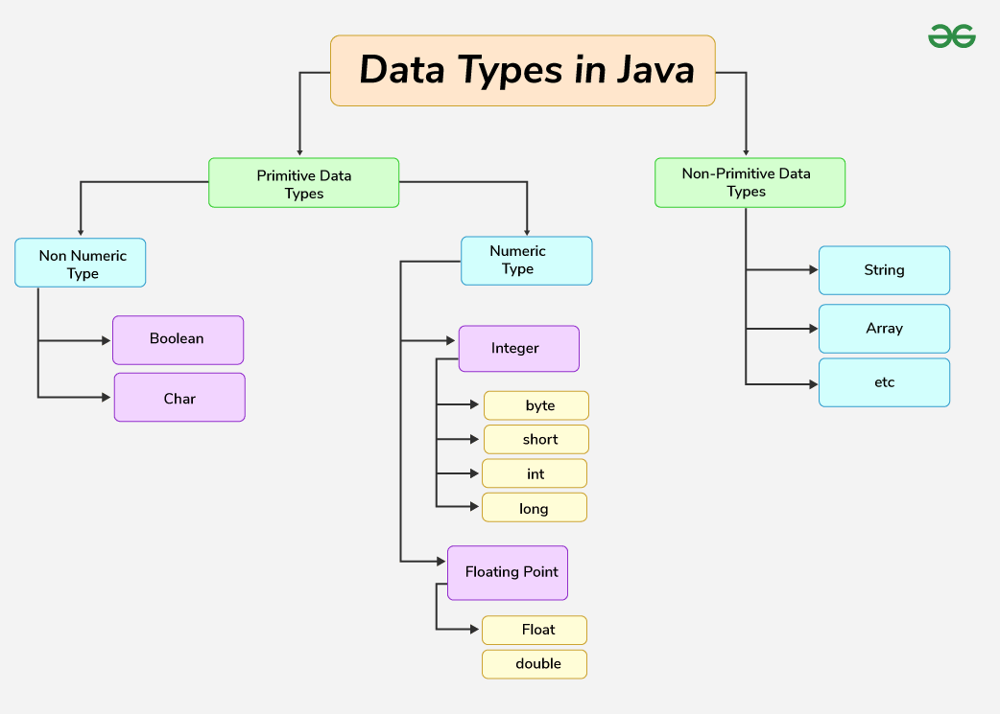

# 01.- Core Java Concepts

<!-- TOC -->

* [01.- Core Java Concepts](#01--core-java-concepts)
    * [1. Syntax and Semantics](#1-syntax-and-semantics)
        * [1.1 Basic Structure of a Java Program](#11-basic-structure-of-a-java-program)
        * [1.2 Java Naming Conventions](#12-java-naming-conventions)
    * [2. Data Types and Variables](#2-data-types-and-variables)
        * [Data Types in Java](#data-types-in-java)
        * [2.1 Primitive Data Types](#21-primitive-data-types)

<!-- TOC -->

## 1. Syntax and Semantics

### 1.1 Basic Structure of a Java Program

A basic Java program consists of several elements including a class definition, a main method, and statements inside the
main method. Here's an example:

```java
public class HelloWorld {
    public static void main(String[] args) {
        System.out.println("Hello, World!");
    }
}
```

- **Class Definition**: `public class HelloWorld` denotes a class named HelloWorld.
- **Main Method**: `public static void main(String[] args)` is the entry point of the program.
- **Method Call**: `System.out.println("Hello, World!");` prints text to the console.

### 1.2 Java Naming Conventions

Java naming conventions enhance code readability and maintainability. Some key conventions include:

- **Class Names**: Should be nouns in PascalCase (e.g., HelloWorld, Employee).
- **Method Names**: Should be verbs in camelCase (e.g., calculateSalary, printHello).
- **Variable Names**: Should be in camelCase (e.g., employeeName, totalAmount).
- **Constant Names**: Should be in UPPERCASE with underscores separating words (e.g., PI, MAX_VALUE).

## 2. Data Types and Variables

Java is statically typed and also a strongly typed language because, in Java, each type of data (such as integer,
character, hexadecimal, packed decimal, and so forth) is predefined as part of the programming language and all
constants or variables defined for a given program must be described with one of the Java data types.

### Data Types in Java

Data types in Java are of different sizes and values that can be stored in the variable that is made as per convenience
and circumstances to cover up all test cases. Java has two categories in which data types are segregated

1. **Primitive Data Type**: such as boolean, char, int, short, byte, long, float, and double
2. **Non-Primitive Data Type or Object Data type**: such as String, Array, etc.



### 2.1 Primitive Data Types

Java provides eight primitive data types to store simple values:

1) **Boolean Data Type**: Represents true or false

The boolean data type represents a logical value that can be either true or false. While conceptually it represents a
single bit of information, the size of the Boolean data type is virtual machine-dependent and is typically one byte (
eight bits) in practice. Values of type boolean are not implicitly or explicitly converted to any other type (with
casts). However, programmers can write conversion code if needed.

```java
// boolean: Represents true or false
boolean booleanFalse = Boolean.FALSE; // false
boolean booleanTrue = Boolean.TRUE;   // true
```

2) **Byte Data Type**: 8-bit integer

The byte data type is an 8-bit signed two’s complement integer. The byte data type is useful for saving memory in large
arrays.

```java
// byte: 8-bit integer
byte byteMin = Byte.MIN_VALUE; // -128
byte byteMax = Byte.MAX_VALUE; // 127
```

3) **Char Data Type**: 16-bit Unicode character

The char data type is a single 16-bit Unicode character with the size of 2 bytes (16 bits).

```java
// char: 16-bit Unicode character
char charMin = Character.MIN_VALUE; // '\u0000'
char charMax = Character.MAX_VALUE; // '\uffff'
```

4) **Short Data Type**: 16-bit integer

The short data type is a 16-bit signed two’s complement integer. Similar to byte, use a short to save memory in large
arrays, in situations where the memory savings actually matters.

```java
// short: 16-bit integer
short shortMin = Short.MIN_VALUE; // -32768
short shortMax = Short.MAX_VALUE; // 32767
```

5) **Integer Data Type**: 32-bit integer

It is a 32-bit signed two’s complement integer.

```java
// int: 32-bit integer
int intMin = Integer.MIN_VALUE; // -2147483648
int intMax = Integer.MAX_VALUE; // 2147483647
```

6) **Long Data Type**: 64-bit integer

The range of a long is quite large. The long data type is a 64-bit two’s complement integer and is useful for those
occasions where an int type is not large enough to hold the desired value. The size of the Long Datatype is 8 bytes (64
bits).

```java
 // long: 64-bit integer
long longMin = Long.MIN_VALUE; // -9223372036854775808L
long longMax = Long.MAX_VALUE; // 9223372036854775807L
```

7) **Float Data Type**: Single-precision 32-bit floating-point

The float data type is a single-precision 32-bit IEEE 754 floating-point. Use a float (instead of double) if you need to
save memory in large arrays of floating-point numbers. The size of the float data type is 4 bytes (32 bits).

```java
// float: Single-precision 32-bit floating-point
float floatMin = -Float.MAX_VALUE; // -3.4028235E38
float floatMax = Float.MAX_VALUE;  // 3.4028235E38
```

8) **Double Data Type**: Double-precision 64-bit floating-point

The double data type is a double-precision 64-bit IEEE 754 floating-point. For decimal values, this data type is
generally the default choice. The size of the double data type is 8 bytes or 64 bits.

```java
// double: Double-precision 64-bit floating-point
double doubleMin = -Double.MAX_VALUE; // -1.7976931348623157E308
double doubleMax = Double.MAX_VALUE;  // 1.7976931348623157E308
```

| Type    | Description             | Default | Size    | Example Literals                            | Range of values                                        |
|---------|-------------------------|---------|---------|---------------------------------------------|--------------------------------------------------------|
| boolean | true or false           | false   | 8 bits  | true, false                                 | true, false                                            |
| byte    | twos-complement integer | 0       | 8 bits  | (none)                                      | -128 to 127                                            |
| char    | Unicode character       | \u0000  | 16 bits | ‘a’, ‘\u0041’, ‘\101’, ‘\\’, ‘\’, ‘\n’, ‘β’ | characters representation of ASCII values 0 to 255     |
| short   | twos-complement integer | 0       | 16 bits | (none)                                      | -32,768 to 32,767                                      |
| int     | twos-complement intger  | 0       | 32 bits | -2,-1,0,1,2                                 | -2,147,483,648to 2,147,483,647                         |
| long    | twos-complement integer | 0       | 64 bits | -2L,-1L,0L,1L,2L                            | -9,223,372,036,854,775,808to 9,223,372,036,854,775,807 |
| float   | IEEE 754 floating point | 0.0     | 32 bits | 1.23e100f , -1.23e-100f , .3f ,3.14F        | upto 7 decimal digits                                  |
| double  | IEEE 754 floating point | 0.0     | 64 bits | 1.23456e300d , -123456e-300d , 1e1d         | upto 16 decimal digits                                 |


