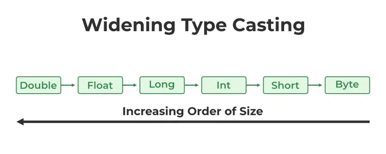
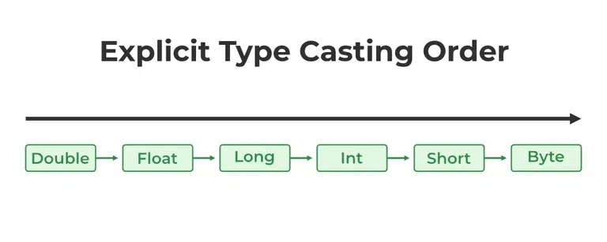

# 2.4 Typecasting in Java

<!-- TOC -->
* [2.4 Typecasting in Java](#24-typecasting-in-java)
  * [2.4.1 Widening Type Casting (Implicit Casting)](#241-widening-type-casting-implicit-casting)
  * [2.4.2 Narrow Type Casting (Explicit Casting)](#242-narrow-type-casting-explicit-casting)
    * [Explicit Upcasting](#explicit-upcasting)
    * [Explicit Downcasting](#explicit-downcasting)
  * [Typecasting in Java – FAQs](#typecasting-in-java--faqs)
<!-- TOC -->

Typecasting in Java is the process of converting one data type to another data type using the casting operator. When you
assign a value from one primitive data type to another type, this is known as type casting. To enable the use of a
variable in a specific manner, this method requires explicitly instructing the Java compiler to treat a variable of one
data type as a variable of another data type.

**Syntax:**

```
<datatype> variableName = (<datatype>) value;
```

**Types of Type Casting**

There are two types of Type Casting in java:

1. Widening Type Casting
2. Narrow Type Casting

## 2.4.1 Widening Type Casting (Implicit Casting)

A lower data type is transformed into a higher one by a process known as widening type casting. Implicit type casting
and casting down are some names for it. It occurs naturally. Since there is no chance of data loss, it is secure.
Widening Type casting occurs when:

* The target type must be larger than the source type.
* Both data types must be compatible with each other.

**Syntax:**

```
larger_data_type variable_name = smaller_data_type_variable;
```



**Examples of Implicit Casting**

* byte to short
* short to int
* int to long
* long to float
* float to double

**Code Example:**

```java
public class ImplicitCastingExample {
    public static void main(String[] args) {
        byte byteValue = 10;
        short shortValue = byteValue; // byte to short
        int intValue = shortValue;    // short to int
        long longValue = intValue;    // int to long
        float floatValue = longValue; // long to float
        double doubleValue = floatValue; // float to double

        System.out.println("Byte value: " + byteValue);
        System.out.println("Short value: " + shortValue);
        System.out.println("Int value: " + intValue);
        System.out.println("Long value: " + longValue);
        System.out.println("Float value: " + floatValue);
        System.out.println("Double value: " + doubleValue);
    }
}
```

## 2.4.2 Narrow Type Casting (Explicit Casting)

The process of downsizing a bigger data type into a smaller one is known as narrowing type casting. Casting up or
explicit type casting are other names for it. It doesn’t just happen by itself. If we don’t explicitly do that, a
compile-time error will occur. Narrowing type casting is unsafe because data loss might happen due to the lower data
type’s smaller range of permitted values. A cast operator assists in the process of explicit casting.

**Syntax:**

```
smaller_data_type variable_name = (smaller_data_type) 
larger_data_type_variable;
```



**Examples of Explicit Casting**

* double to float
* float to long
* long to int
* int to short
* short to byte

**Code Example:**

```java
public class ExplicitCastingExample {
    public static void main(String[] args) {
        double doubleValue = 9.78;
        float floatValue = (float) doubleValue;  // double to float
        long longValue = (long) floatValue;      // float to long
        int intValue = (int) longValue;          // long to int
        short shortValue = (short) intValue;     // int to short
        byte byteValue = (byte) shortValue;      // short to byte

        System.out.println("Double value: " + doubleValue);
        System.out.println("Float value: " + floatValue);
        System.out.println("Long value: " + longValue);
        System.out.println("Int value: " + intValue);
        System.out.println("Short value: " + shortValue);
        System.out.println("Byte value: " + byteValue);
    }
}
```

**Types of Explicit Casting**
Mainly there are two types of Explicit Casting:

* **Explicit Upcasting:** No data loss, automatic conversion by the compiler.
* **Explicit Downcasting:** Possible data loss, requires manual conversion by the programmer.

### Explicit Upcasting

Upcasting is the process of casting a subtype to a supertype in the inheritance tree’s upward direction. When a
sub-class object is referenced by a superclass reference variable, an automatic process is triggered without any further
effort.

```java
class Animal {
    public void makeSound() {
        System.out.println("The animal makes a sound");
    }
}

class Dog extends Animal {
    public void makeSound() {
        System.out.println("The dog barks");
    }

    public void fetch() {
        System.out.println("The dog fetches a ball");
    }
}

class GFG {
    public static void main(String[] args) {
        // Upcasting 
        Animal animal = new Dog();
        // Calls the overridden method in Dog class 
        animal.makeSound();
        // This would give a compile error as fetch() is not 
        // a method in Animal class 
        // animal.fetch(); 
    }
}
```

```
The dog barks
```

### Explicit Downcasting

When a subclass type refers to an object of the parent class, the process is referred to as downcasting. If it is done
manually, the compiler issues a runtime ClassCastException error. It can only be done by using the instanceof operator.
Only the downcast of an object that has already been upcast is possible.

```java
class Animal {
    public void eat() {
        System.out.println("The animal is eating.");
    }
}

class Cat extends Animal {
    public void meow() {
        System.out.println("The cat is meowing.");
    }
}

class GFG {
    public static void main(String[] args) {
        Animal animal = new Cat();
        animal.eat();

        // Explicit downcasting 
        Cat cat = (Cat) animal;
        cat.meow();
    }
}
```

```
The animal is eating.
The cat is meowing.
```

## Typecasting in Java – FAQs

1. **What is typecasting in Java?**
   Typecasting in Java is the process of converting a variable from one data type to another. This can be achieved
   either implicitly (automatic conversion) or explicitly (manual conversion).
2. **What are the two types of typecasting in Java?**

   The two types of typecasting in Java are:
    - Widening Type Casting (Implicit Casting)
    - Narrow Type Casting (Explicit Casting)
3. **Explain widening type casting with an example:**

   Widening type casting, or implicit casting, occurs when a smaller data type is converted to a larger data type
   automatically by the compiler
    ```java
    int intValue = 100;
    long longValue = intValue; // int to long
    ```
4. **Explain narrowing type casting with an example**

   Narrowing type casting, or explicit casting, requires the programmer to manually convert a larger data type to a
   smaller data type.
    ```java
    int intValue = 100;
    long longValue = intValue; // int to long
    ```
5. **What are some common scenarios where implicit casting is used?**

   Implicit casting is commonly used in arithmetic operations, assignments, and method calls where the argument types
   are automatically converted to match the parameter types.
6. **What are the risks associated with explicit casting?**

   Explicit casting can lead to data loss or overflow if the target data type cannot accommodate the original value. For
   instance, casting a large long value to an int may result in loss of precision.
7. **Can you provide a code example of implicit casting from byte to double?**
   ```java
      public class ImplicitCastingExample {
       public static void main(String[] args) {
       byte byteValue = 10;
       double doubleValue = byteValue; // byte to double
       System.out.println("Byte value: " + byteValue);
       System.out.println("Double value: " + doubleValue);
       }
      }
   ```
8. Can you provide a code example of explicit casting from double to byte?
   ```java
    public class ExplicitCastingExample {
        public static void main(String[] args) {
            double doubleValue = 9.78;
            byte byteValue = (byte) doubleValue; // double to byte
            System.out.println("Double value: " + doubleValue);
            System.out.println("Byte value: " + byteValue);
        }
   }
   ```

9. **What is upcasting in Java?**

   Upcasting is the process of casting a subtype to a supertype in the inheritance hierarchy. It is usually done
   implicitly.
   ```java
   Dog dog = new Dog();
   Animal animal = dog; // Upcasting
   ```

10. **What is downcasting in Java?**

    Downcasting is the process of casting a supertype to a subtype in the inheritance hierarchy. It requires explicit
    casting and can potentially throw a ClassCastException if not done correctly.
     ```java
    Animal animal = new Dog();
    Dog dog = (Dog) animal; // Downcasting
    ```

11. **Why is explicit casting necessary in Java?**

    Explicit casting is necessary when you want to convert a larger data type to a smaller data type (narrowing
    conversion),
    or when you need to cast an object to a specific subtype in an inheritance hierarchy.

12. **What is the difference between upcasting and downcasting?**

    Upcasting is the conversion from a subtype to a supertype and is usually done implicitly. Downcasting is the
    conversion
    from a supertype to a subtype and requires explicit casting.

13. **What will happen if you try to downcast an object to an incompatible type?**

    If you try to downcast an object to an incompatible type, a ClassCastException will be thrown at runtime. It is good
    practice to use the instanceof operator to check the type before downcasting.

14. **How does the instanceof operator help in typecasting?**

    The instanceof operator helps to check if an object is an instance of a specific class or subclass before performing
    a downcast, thus preventing ClassCastException.

15. **Can you give an example where instanceof is used before downcasting?**
    ```java
    Animal animal = new Cat();
    if (animal instanceof Cat) {
        Cat cat = (Cat) animal; // Safe downcasting
        cat.meow();
    }
    ```


