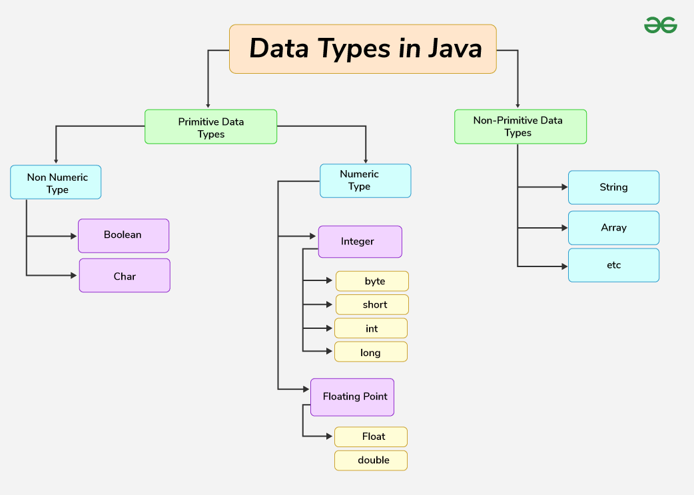

# 1.1.2 Data Types and Variables

<!-- TOC -->

* [1.1.2 Data Types and Variables](#112-data-types-and-variables)
    * [1.1.2.1 Primitive Data Types](#1121-primitive-data-types)
        * [Primitive Data Types in Java – FAQs](#primitive-data-types-in-java--faqs)
    * [1.1.2.2 Reference data types or Non-Primitive Data Type](#1122-reference-data-types-or-non-primitive-data-type)
        * [Reference Data Types in Java – FAQs](#reference-data-types-in-java--faqs)

<!-- TOC -->

Java is statically typed and also a strongly typed language because, in Java, each type of data (such as integer,
character, hexadecimal, packed decimal, and so forth) is predefined as part of the programming language and all
constants or variables defined for a given program must be described with one of the Java data types.

**Data Types in Java**

Data types in Java are of different sizes and values that can be stored in the variable that is made as per convenience
and circumstances to cover up all test cases. Java has two categories in which data types are segregated

1. **Primitive Data Type**: such as boolean, char, int, short, byte, long, float, and double
2. **Non-Primitive Data Type or Object Data type**: such as String, Array, etc.



## 1.1.2.1 Primitive Data Types

Java provides eight primitive data types to store simple values:

1) **Boolean Data Type**: Represents true or false

The boolean data type represents a logical value that can be either true or false. While conceptually it represents a
single bit of information, the size of the Boolean data type is virtual machine-dependent and is typically one byte (
eight bits) in practice. Values of type boolean are not implicitly or explicitly converted to any other type (with
casts). However, programmers can write conversion code if needed.

| Type    | Description   | Default | Size   | Example Literals | Range of values |
|---------|---------------|---------|--------|------------------|-----------------|
| boolean | true or false | false   | 8 bits | true, false      | true, false     |

```java
// boolean: Represents true or false
boolean booleanFalse = Boolean.FALSE; // false
boolean booleanTrue = Boolean.TRUE;   // true
```

2) **Byte Data Type**: 8-bit integer

The byte data type is an 8-bit signed two’s complement integer. The byte data type is useful for saving memory in large
arrays.

| Type | Description             | Default | Size   | Example Literals | Range of values |
|------|-------------------------|---------|--------|------------------|-----------------|
| byte | twos-complement integer | 0       | 8 bits | (none)           | -128 to 127     |

```java
// byte: 8-bit integer
byte byteMin = Byte.MIN_VALUE; // -128
byte byteMax = Byte.MAX_VALUE; // 127
```

3) **Char Data Type**: 16-bit Unicode character

The char data type is a single 16-bit Unicode character with the size of 2 bytes (16 bits).

| Type | Description       | Default | Size    | Example Literals                            | Range of values                                    |
|------|-------------------|---------|---------|---------------------------------------------|----------------------------------------------------|
| char | Unicode character | \u0000  | 16 bits | ‘a’, ‘\u0041’, ‘\101’, ‘\\’, ‘\’, ‘\n’, ‘β’ | characters representation of ASCII values 0 to 255 |

```java
// char: 16-bit Unicode character
char charMin = Character.MIN_VALUE; // '\u0000'
char charMax = Character.MAX_VALUE; // '\uffff'
```

4) **Short Data Type**: 16-bit integer

| Type  | Description             | Default | Size    | Example Literals | Range of values   |
|-------|-------------------------|---------|---------|------------------|-------------------|
| short | twos-complement integer | 0       | 16 bits | (none)           | -32,768 to 32,767 |

The short data type is a 16-bit signed two’s complement integer. Similar to byte, use a short to save memory in large
arrays, in situations where the memory savings actually matters.

```java
// short: 16-bit integer
short shortMin = Short.MIN_VALUE; // -32768
short shortMax = Short.MAX_VALUE; // 32767
```

5) **Integer Data Type**: 32-bit integer

| Type | Description            | Default | Size    | Example Literals | Range of values                |
|------|------------------------|---------|---------|------------------|--------------------------------|
| int  | twos-complement intger | 0       | 32 bits | -2,-1,0,1,2      | -2,147,483,648to 2,147,483,647 ||

It is a 32-bit signed two’s complement integer.

```java
// int: 32-bit integer
int intMin = Integer.MIN_VALUE; // -2147483648
int intMax = Integer.MAX_VALUE; // 2147483647
```

6) **Long Data Type**: 64-bit integer

| Type | Description             | Default | Size    | Example Literals | Range of values                                        |
|------|-------------------------|---------|---------|------------------|--------------------------------------------------------|
| long | twos-complement integer | 0       | 64 bits | -2L,-1L,0L,1L,2L | -9,223,372,036,854,775,808to 9,223,372,036,854,775,807 |

The range of a long is quite large. The long data type is a 64-bit two’s complement integer and is useful for those
occasions where an int type is not large enough to hold the desired value. The size of the Long Datatype is 8 bytes (64
bits).

```java
 // long: 64-bit integer
long longMin = Long.MIN_VALUE; // -9223372036854775808L
long longMax = Long.MAX_VALUE; // 9223372036854775807L
```

7) **Float Data Type**: Single-precision 32-bit floating-point

| Type  | Description             | Default | Size    | Example Literals                     | Range of values       |
|-------|-------------------------|---------|---------|--------------------------------------|-----------------------|
| float | IEEE 754 floating point | 0.0     | 32 bits | 1.23e100f , -1.23e-100f , .3f ,3.14F | upto 7 decimal digits |

The float data type is a single-precision 32-bit IEEE 754 floating-point. Use a float (instead of double) if you need to
save memory in large arrays of floating-point numbers. The size of the float data type is 4 bytes (32 bits).

```java
// float: Single-precision 32-bit floating-point
float floatMin = -Float.MAX_VALUE; // -3.4028235E38
float floatMax = Float.MAX_VALUE;  // 3.4028235E38
```

8) **Double Data Type**: Double-precision 64-bit floating-point

| Type   | Description             | Default | Size    | Example Literals                    | Range of values        |
|--------|-------------------------|---------|---------|-------------------------------------|------------------------|
| double | IEEE 754 floating point | 0.0     | 64 bits | 1.23456e300d , -123456e-300d , 1e1d | upto 16 decimal digits |

The double data type is a double-precision 64-bit IEEE 754 floating-point. For decimal values, this data type is
generally the default choice. The size of the double data type is 8 bytes or 64 bits.

```java
// double: Double-precision 64-bit floating-point
double doubleMin = -Double.MAX_VALUE; // -1.7976931348623157E308
double doubleMax = Double.MAX_VALUE;  // 1.7976931348623157E308
```

**Summary**

| Type    | Description             | Default | Size    | Example Literals                            | Range of values                                        |
|---------|-------------------------|---------|---------|---------------------------------------------|--------------------------------------------------------|
| boolean | true or false           | false   | 8 bits  | true, false                                 | true, false                                            |
| byte    | twos-complement integer | 0       | 8 bits  | (none)                                      | -128 to 127                                            |
| char    | Unicode character       | \u0000  | 16 bits | ‘a’, ‘\u0041’, ‘\101’, ‘\\’, ‘\’, ‘\n’, ‘β’ | characters representation of ASCII values 0 to 255     |
| short   | twos-complement integer | 0       | 16 bits | (none)                                      | -32,768 to 32,767                                      |
| int     | twos-complement intger  | 0       | 32 bits | -2,-1,0,1,2                                 | -2,147,483,648to 2,147,483,647                         |
| long    | twos-complement integer | 0       | 64 bits | -2L,-1L,0L,1L,2L                            | -9,223,372,036,854,775,808to 9,223,372,036,854,775,807 |
| float   | IEEE 754 floating point | 0.0     | 32 bits | 1.23e100f , -1.23e-100f , .3f ,3.14F        | upto 7 decimal digits                                  |
| double  | IEEE 754 floating point | 0.0     | 64 bits | 1.23456e300d , -123456e-300d , 1e1d         | upto 16 decimal digits                                 |

### Primitive Data Types in Java – FAQs

1. **What are the eight primitive data types in Java?**

The eight primitive data types in Java are:

- `byte`
- `short`
- `int`
- `long`
- `float`
- `double`
- `char`
- `boolean`

2. **What is the range of the `byte` data type?**

   The `byte` data type is an 8-bit signed integer with a range from `-128` to `127`.

3. **How much memory does a `float` data type occupy?**

   A `float` data type occupies 4 bytes (32 bits) of memory.

4. **What is the default value of an uninitialized `boolean` variable in Java?**

   The default value of an uninitialized `boolean` variable is `false`.

5. **What is the difference between `float` and `double` in Java?**

   The main differences are:
    - `float` is a single-precision 32-bit floating-point.
    - `double` is a double-precision 64-bit floating-point.
    - `double` offers more precision and a larger range compared to `float`.

6. **Can a `char` data type store a numeric value?**

   Yes, a `char` data type can store a numeric value because it represents a 16-bit Unicode character. You can use the
   Unicode value of a character. For example, `char c = 65;` will store the character `'A'`.

7. **What is the purpose of the `long` data type, and when should it be used?**

   The `long` data type is a 64-bit signed integer. It should be used when you need a range of values wider than those
   provided by `int`. For example, it can be used for large counts, timestamps, or large numeric calculations.

8. **What is the range of the `int` data type?**

   The `int` data type is a 32-bit signed integer with a range from `-2,147,483,648` to `2,147,483,647`.

9. **How do you declare a `char` variable with the character 'Z'?**

   ```java
   char myChar = 'Z';
   ```
10. **What happens if you assign a floating-point number to a float variable without the f suffix?**

    If you assign a floating-point number to a float variable without the f suffix, you will get a compilation error
    because
    the default type for floating-point literals is double. You should use the f suffix to explicitly specify a float
    literal.
    ```java
    float myFloat = 3.14f; // Correct
    ```
11. **What is the default value of an uninitialized int variable in Java?**

    The default value of an uninitialized int variable is 0.
12. **Can you store a long value in an int variable? Why or why not?**
    No, you cannot store a long value in an int variable because a long is 64 bits and an int is 32 bits. This would
    result in a loss of information. However, you can cast the long to an int explicitly, but this may lead to data loss
    if the long value exceeds the range of int.
    ```java
    long longValue = 100000L;
    int intValue = (int) longValue; // Explicit casting
    ```
13. **How do you declare a boolean variable and initialize it to true?**
    ```java
    boolean isTrue = true;
    ```
14. **What is the difference between == and = in Java?**    
    `==` is the equality operator and is used to compare two values for equality.

    `=` is the assignment operator and is used to assign a value to a variable.
    ```java
    int a = 5;      // Assignment
    boolean result = (a == 5); // Equality check
    ```
15. **Can you use underscores in numeric literals? Provide an example.**
    Yes, you can use underscores in numeric literals to make them more readable. For example:
    ```java
    int million = 1_000_000;
    long creditCardNumber = 1234_5678_9012_3456L;
    ```

---

## 1.1.2.2 Reference data types or Non-Primitive Data Type

The Reference Data Types will contain a memory address of variable values because the reference types won’t store the
variable value directly in memory. They are strings, objects, arrays, etc.

In Java, non-primitive data types, also known as reference data types, are more complex than primitive data types. These
types are used to store multiple values or more complex data structures. Unlike primitive data types, which store actual
values, reference data types store references (or addresses) to the actual data.

**Types of Non-Primitive Data Types**

* **Arrays**: is a group of like-typed variables that are referred to by a common name
    ```java
  public class ArrayExample {
    public static void main(String[] args) {
        // Declare and initialize an array
        int[] numbers = {1, 2, 3, 4, 5};

        // Access elements
        System.out.println("First element: " + numbers[0]);

        // Modify elements
        numbers[2] = 99;
        System.out.println("Modified third element: " + numbers[2]);

        // Loop through the array
        for (int number : numbers) {
            System.out.println(number);
            }
        }
    }
    ```

* **Classes**: is a user-defined blueprint or prototype from which objects are created. It represents the set of
  properties
  or methods that are common to all objects of one type. In general, class declarations can include these components, in
  order
    * Modifiers
    * Class name
    * Superclass(if any)
    * Interfaces(if any)
    * Body
  ```java
    // Define a class
    class Car {
        // Fields
        String color;
        String model;
    
        // Constructor
        Car(String color, String model) {
            this.color = color;
            this.model = model;
        }
    
        // Method
        void displayInfo() {
            System.out.println("Car Model: " + model + ", Color: " + color);
        }
    }
    
    // Main class to test the Car class
    public class Main {
        public static void main(String[] args) {
            // Create an object of Car
            Car myCar = new Car("Red", "Tesla Model S");
    
            // Use the object
            myCar.displayInfo();
        }
    }
  ```
* Object: is a basic unit of Object-Oriented Programming and represents real-life entities. A typical Java program
  creates many objects, which as you know, interact by invoking methods. An object consists of :
    * **State**: It is represented by the attributes of an object. It also reflects the properties of an object.
    * **Behavior**: It is represented by the methods of an object. It also reflects the response of an object to other
      objects.
    * **Identity**: It gives a unique name to an object and enables one object to interact with other objects.
    ```java
    public class ObjectExample {
        public static void main(String[] args) {
            // Creating an Object of the Car class
            Car myCar = new Car("Blue", "BMW i8");
    
            // Using the toString() method inherited from the Object class
            System.out.println(myCar.toString());
    
            // Using the equals() method
            Car anotherCar = new Car("Blue", "BMW i8");
            System.out.println(myCar.equals(anotherCar)); // This will print false unless equals() is overridden in Car class
    
            // Using getClass() method
            System.out.println("Class of myCar: " + myCar.getClass().getName());
        }
    }
    
    // Define a class
    class Car {
        // Fields
        String color;
        String model;
    
        // Constructor
        Car(String color, String model) {
            this.color = color;
            this.model = model;
        }
    
        // Overriding toString() method
        @Override
        public String toString() {
            return "Car Model: " + model + ", Color: " + color;
        }
    }  
    ```

* **Interfaces**: Like a class, an interface can have methods and variables, but the methods declared in an interface
  are by default abstract (only method signature, no body). Interfaces specify what a class must do and not how. It is
  the blueprint of the class.

    ```java
    // Define an interface
    interface Animal {
        void sound();
    }
    
    // Implement the interface in a class
    class Dog implements Animal {
        public void sound() {
            System.out.println("Woof");
        }
    }
    
    // Main class to test the interface
    public class Main {
        public static void main(String[] args) {
            Animal myDog = new Dog();
            myDog.sound();
        }
    }  
    ```

* **Strings**: are defined as an array of characters. The difference between a character array and a string in Java is,
  that the string is designed to hold a sequence of characters in a single variable whereas, a character array is a
  collection of separate char-type entities.

    ```java
     public class StringExample {
        public static void main(String[] args) {
            // Create a string
            String greeting = "Hello, World!";
    
            // String length
            System.out.println("Length: " + greeting.length());
    
            // Getting a character at a specific index
            System.out.println("Character at index 1: " + greeting.charAt(1));
    
            // Substring
            System.out.println("Substring from index 7: " + greeting.substring(7));
    
            // String concatenation
            String name = "Alice";
            String message = greeting + " " + name;
            System.out.println("Concatenated message: " + message);
        }
    } 
    ```

**Characteristics**

* **Dynamic Nature**: Reference data types can accommodate a varying number of elements.
* **Memory Location**: They store the address of where the data is located in memory.
* **Null Default Value**: The default value of any reference variable is null.
* **Methods and Properties**: They can have methods and properties associated with them.

**Summary**
Non-primitive data types in Java, also known as reference data types, include arrays, classes, interfaces, and strings.
These types store references to memory locations and can encapsulate more complex data structures and functionalities
compared to primitive data types. Understanding and using these types effectively is crucial for proficient Java
programming.

### Reference Data Types in Java – FAQs

**General Understanding**

1. **What are reference data types in Java?**
    - Reference data types are types that store references (addresses) to the actual data rather than the data itself.
      They include classes, interfaces, arrays, strings, and objects.

2. **How do reference data types differ from primitive data types?**
    - Reference data types store references to the actual data, while primitive data types store the actual data values
      directly. Reference types can be `null`, have methods and properties, and their size is consistent regardless of
      the data they reference.

**Arrays**

3. **How do you declare and initialize an array in Java?**
    ```java
    int[] numbers = new int[5]; // Declaration and memory allocation
    int[] numbers = {1, 2, 3, 4, 5}; // Declaration and initialization
    ```

4. **What is the difference between a one-dimensional and a multi-dimensional array?**
    - A one-dimensional array is a single list of elements. A multi-dimensional array, like a two-dimensional array, is
      an array of arrays, essentially forming a matrix.

5. **How do you iterate through an array in Java?**
    ```java
    int[] numbers = {1, 2, 3, 4, 5};
    for (int number : numbers) {
        System.out.println(number);
    }
    ```

**Classes and Objects**

6. **What is the difference between a class and an object in Java?**
    - A class is a blueprint for creating objects. It defines the properties and behaviors (methods) that the objects
      created from the class will have. An object is an instance of a class.

7. **What is inheritance in Java?**
    - Inheritance is a mechanism where one class (subclass) inherits the properties and methods of another class (
      superclass), allowing for reuse and extension of existing code.

8. **How do you create an object in Java?**
    ```java
    Car myCar = new Car("Red", "Tesla Model S");
    ```

**Interfaces**

9. **What is an interface in Java, and how is it different from an abstract class?**
    - An interface is a reference type in Java that can contain only constants, method signatures, default methods,
      static methods, and nested types. Abstract classes can have a mix of fully implemented and unimplemented methods.
      Interfaces support multiple inheritance, whereas classes do not.

10. **How do you implement an interface in a class?**
    ```java
    interface Animal {
        void sound();
    }
    
    class Dog implements Animal {
        public void sound() {
            System.out.println("Woof");
        }
    }
    ```

**Strings**

11. **What is the difference between `String`, `StringBuilder`, and `StringBuffer`?**
    - `String` is immutable and cannot be changed once created.
    - `StringBuilder` is mutable and not synchronized, making it faster but not thread-safe.
    - `StringBuffer` is mutable and synchronized, making it thread-safe but slower.

12. **How do you concatenate strings in Java?**
    ```java
    String greeting = "Hello";
    String name = "Alice";
    String message = greeting + ", " + name;
    ```

**Objects and Object Class**

13. **What is the significance of the `Object` class in Java?**
    - The `Object` class is the root of the class hierarchy in Java. Every class in Java inherits from the `Object`
      class, either directly or indirectly. It provides fundamental methods like `toString()`, `equals()`, `hashCode()`,
      etc.

14. **How do you override the `toString()` method in a class?**
    ```java
      class Car {
          String color;
          String model;

          Car(String color, String model) {
              this.color = color;
              this.model = model;
          }

          @Override
          public String toString() {
              return "Car Model: " + model + ", Color: " + color;
          }
      }
      ```

**Memory Management**

15. **What is the difference between stack memory and heap memory in Java?**
    - **Stack memory** is used for static memory allocation and method execution. It stores **primitive data types** and
      references to objects in heap memory. **Heap memory** is used for **dynamic memory allocation**, where **objects**
      and their
      **instance** **variables** are stored.

16. **What happens when you assign one reference variable to another?**
    - When you assign one reference variable to another, both variables will reference the same object in memory.
      Changes made through one reference will reflect in the other.

**Miscellaneous**

17. **What is autoboxing and unboxing in Java?**
    - Autoboxing is the automatic conversion of primitive types to their corresponding wrapper classes (e.g., `int` to
      `Integer`). Unboxing is the reverse process, converting wrapper class objects to primitive types.

18. **Why are strings immutable in Java?**
    - Strings are immutable in Java to provide security, synchronization, and performance benefits. Immutability ensures
      that a string cannot be altered once created, reducing the risk of unexpected behavior and making the strings
      thread-safe.
      You can save this content into a file named README.md for easy reference and sharing.

---