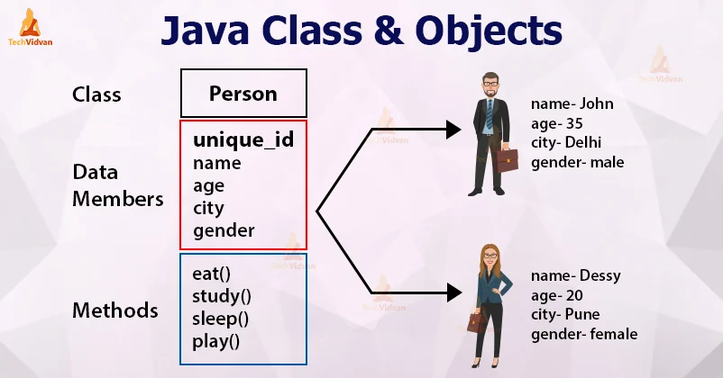
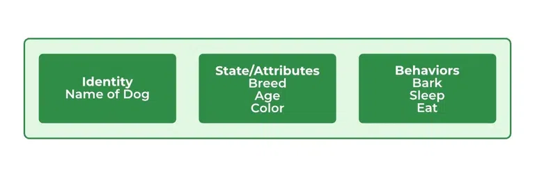
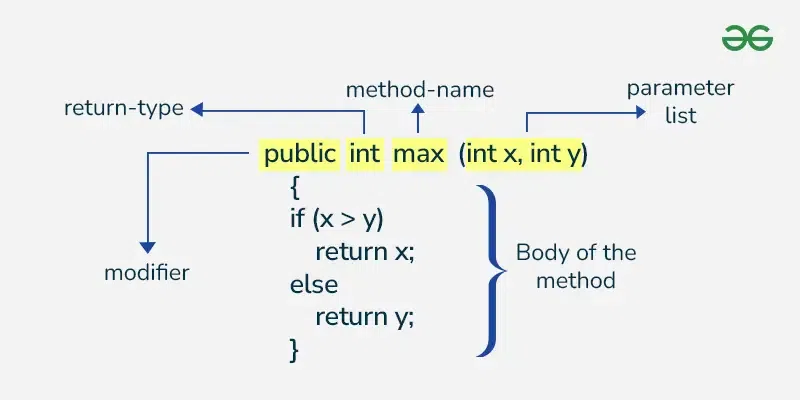

# 1.2.1 Classes and Objects

In Java, a **class** is a blueprint for creating objects. It encapsulates data for the object and methods to manipulate
that data.

**Objects** are instances of classes, and they represent real-world entities.

Understanding how to define and
instantiate classes is fundamental to object-oriented programming in Java.



---

<!-- TOC -->
* [1.2.1 Classes and Objects](#121-classes-and-objects)
    * [1.2.1.1 Class definition and instantiation](#1211-class-definition-and-instantiation)
      * [Class Definition or Declaration](#class-definition-or-declaration)
      * [Instantiation](#instantiation)
      * [Objects](#objects)
      * [Declaring Objects (Also called instantiating a class)](#declaring-objects-also-called-instantiating-a-class)
      * [Ways to Create an Object of a Class](#ways-to-create-an-object-of-a-class)
      * [Difference between Java Class and Objects](#difference-between-java-class-and-objects)
      * [Class definition and instantiation - FAQs](#class-definition-and-instantiation---faqs)
    * [1.2.1.2 Fields and Methods](#1212-fields-and-methods)
      * [Key Concepts](#key-concepts)
      * [Methods](#methods)
        * [Method Declaration](#method-declaration)
        * [Types of Methods](#types-of-methods)
        * [Ways to Create Method](#ways-to-create-method)
        * [Method Signature:](#method-signature)
        * [Naming a Method](#naming-a-method)
        * [Method Calling](#method-calling)
        * [Passing Parameters to a method](#passing-parameters-to-a-method)
        * [Memory Allocation for Methods Calls](#memory-allocation-for-methods-calls)
        * [Advantages to using methods](#advantages-to-using-methods)
      * [Fields and Methods in Java - FAQs](#fields-and-methods-in-java---faqs)
    * [1.2.1.3 Constructors (default and parameterized)](#1213-constructors-default-and-parameterized)
      * [Key Concepts](#key-concepts-1)
      * [How Java Constructors are Different From Java Methods?](#how-java-constructors-are-different-from-java-methods)
      * [Default Constructor](#default-constructor)
      * [Parameterized Constructor](#parameterized-constructor)
      * [Constructor Overloading](#constructor-overloading)
      * [Private Constructor](#private-constructor)
      * [Best Practices](#best-practices)
      * [Constructors – FAQs](#constructors--faqs)
<!-- TOC -->

--- 

### 1.2.1.1 Class definition and instantiation

1. **Class Definition**:
    - A class is defined using the `class` keyword, followed by the class name and a pair of curly braces `{}` which
      contain the class members (fields and methods).
    - A class can contain:
        - **Fields** (attributes/properties) - Variables to hold data.
        - **Methods** - Functions that define the behavior of the class.

2. **Instantiation**:
    - Creating an instance (object) of a class is done using the `new` keyword followed by the class constructor.
    - Constructors are special methods called when an object is created, and they can be overloaded to provide multiple
      ways to instantiate a class.

3. **Access Modifiers**:
    - Java provides access modifiers (`public`, `private`, `protected`, and package-private) to control the visibility
      of class members.

4. **Encapsulation**:
    - This is the practice of bundling the data (fields) and methods that operate on the data into a single unit (
      class). It restricts direct access to some of an object’s components, which is a means of preventing unintended
      interference and misuse.

- **Properties of Java Classes**
    - Class is not a real-world entity. It is just a template or blueprint or prototype from which objects are created.
    - Class does not occupy memory.
    - Class is a group of variables of different data types and a group of methods.
    - A Class in Java can contain:
        - Data member
        - Method
        - Constructor
        - Nested Class
        - Interface

#### Class Definition or Declaration

**Syntax:**

```
access_modifier class <class_name>
{  
    data member;  
    method;  
    constructor;
    nested class;
    interface;
}
```

**Code Example:**

```java
public class Car {
    // Fields (attributes)
    private String make;
    private String model;
    private int year;

    // Constructor
    public Car(String make, String model, int year) {
        this.make = make;
        this.model = model;
        this.year = year;
    }

    // Method to display car details
    public void displayDetails() {
        System.out.println("Car Make: " + make);
        System.out.println("Car Model: " + model);
        System.out.println("Car Year: " + year);
    }
}
```

#### Instantiation

**Code Example:**

```java
public class Main {
    public static void main(String[] args) {
        // Creating an instance of the Car class
        Car myCar = new Car("Toyota", "Corolla", 2020);

        // Calling a method on the object
        myCar.displayDetails();
    }
}

```

#### Objects

An object in Java is a basic unit of Object-Oriented Programming and represents real-life entities. Objects are the
instances of a class that are created to use the attributes and methods of a class. A typical Java program creates many
objects, which as you know, interact by invoking methods. An object consists of :

1. **State:** It is represented by attributes of an object. It also reflects the properties of an object.
2. **Behavior:** It is represented by the methods of an object. It also reflects the response of an object with other
   objects.
3. **Identity:** It gives a unique name to an object and enables one object to interact with other objects.

Example of an object: dog:



Objects correspond to things found in the real world. For example, a graphics program may have objects such as “circle”,
“square”, and “menu”. An online shopping system might have objects such as “shopping cart”, “customer”, and “product”.

> **Note**: When we create an object which is a non primitive data type, it’s always allocated on the **heap memory**.

#### Declaring Objects (Also called instantiating a class)

When an object of a class is created, the class is said to be instantiated . All the instances share the attributes and
the behavior of the class. But the values of those attributes, i.e. the state are unique for each object. A single class
may have any number of instances.


**Code Example:**

```java
// Class Declaration
public class Dog {
    // Instance Variables
    String name;
    String breed;
    int age;
    String color;

    // Constructor Declaration of Class
    public Dog(String name, String breed, int age,
               String color) {
        this.name = name;
        this.breed = breed;
        this.age = age;
        this.color = color;
    }

    // method 1
    public String getName() {
        return name;
    }

    // method 2
    public String getBreed() {
        return breed;
    }

    // method 3
    public int getAge() {
        return age;
    }

    // method 4
    public String getColor() {
        return color;
    }

    @Override
    public String toString() {
        return ("Hi my name is " + this.getName()
                + ".\nMy breed,age and color are "
                + this.getBreed() + "," + this.getAge()
                + "," + this.getColor());
    }

    public static void main(String[] args) {
        Dog tuffy = new Dog("tuffy", "papillon", 5, "white");
        System.out.println(tuffy.toString());
    }
}
```

**Output:**

```
Hi my name is tuffy.
My breed,age and color are papillon,5,white
```

#### Ways to Create an Object of a Class

1. **Using new keyword**

   It is the most common and general way to create an object in Java.
    ```
   // creating object of class Test
    Test t = new Test();
    ```
2. **Using Class.forName(String className) method**

   There is a pre-defined class in java.lang package with name Class. The forName(String className) method returns the
   Class object associated with the class with the given string name. We have to give a fully qualified name for a
   class. On calling the new Instance() method on this Class object returns a new instance of the class with the given
   string name.
    ```
    // creating object of public class Test
    // consider class Test present in com.p1 package
    Test obj = (Test)Class.forName("com.p1.Test").newInstance();
    ``` 

3. **Using clone() method**

   clone() method is present in the Object class. It creates and returns a copy of the object.
    ```
    // creating object of class Test
    Test t1 = new Test();
    // creating clone of above object
    Test t2 = (Test)t1.clone();
    ``` 

4. **Deserialization**

   De-serialization is a technique of reading an object from the saved state in a file. Refer to
   Serialization/De-Serialization in Java
    ```
    FileInputStream file = new FileInputStream(filename);
    ObjectInputStream in = new ObjectInputStream(file);
    Object obj = in.readObject();
    ``` 

#### Difference between Java Class and Objects

| **Class**                                                          | **Object**                                                   |
|--------------------------------------------------------------------|--------------------------------------------------------------|
| Class is the blueprint of an object. It is used to create objects. | An object is an instance of the class.                       |
| No memory is allocated when a class is declared.                   | Memory is allocated as soon as an object is created.         |
| A class is a group of similar objects.                             | An object is a real-world entity such as a book, car, etc.   |
| Class is a logical entity.                                         | An object is a physical entity.                              |
| A class can only be declared once.                                 | Objects can be created many times as per requirement.        |
| An example of class can be a car.                                  | Objects of the class car can be BMW, Mercedes, Ferrari, etc. |

#### Class definition and instantiation - FAQs

1. **What is a class in Java?**
    - A class in Java is a blueprint for creating objects. It defines the structure and behavior (attributes and
      methods) that the objects created from the class will have.

2. **How do you define a class in Java?**
    - A class is defined using the class keyword, followed by the class name and a pair of curly braces containing the
      class members (fields and methods). Example:
   ```java
   public class Car {
        // fields and methods
    }
   ```
3. **What is instantiation in the context of classes?**
    - Instantiation is the process of creating an instance (object) of a class using the new keyword followed by the
      class constructor. For example:
   ```java
   Car myCar = new Car("Toyota", "Corolla", 2020);
   ```

4. **What is the purpose of the new keyword?**
    - The new keyword is used to create a new instance of a class. It allocates memory for the object and invokes the
      class constructor to initialize it.

5. **What is the difference between a class and an object?**
    - A class is a blueprint for creating objects (i.e., a definition), whereas an object is an instance of a class (
      i.e., a concrete entity). Classes do not occupy memory until instantiated, while objects do.

--- 

### 1.2.1.2 Fields and Methods

In Java, fields and methods are integral parts of classes that define **the attributes (state)** and **behaviors (
functionality)** of the objects created from those classes. Understanding these concepts is crucial for effective
object-oriented programming.

**Overview**

- **Fields** (also known as attributes or instance variables) are variables defined within a class that hold the state
  or data of an object.
- **Methods** are functions defined in a class that specify the behaviors or actions that can be performed on the
  objects of that class.

#### Key Concepts

**Fields**

1. **Definition**: Fields are defined within a class and represent the properties or characteristics of an object. They
   can hold data of various types (primitive or reference types).

2. **Access Modifiers**: Fields can have access modifiers (`public`, `private`, `protected`, or package-private) that
   control their visibility. This helps enforce encapsulation by restricting direct access to the fields.

3. **Initialization**: Fields can be initialized at declaration, in constructors, or through methods.

4. **Static Fields**: Fields can be declared as `static`, meaning they belong to the class rather than to any specific
   instance. All instances of the class share static fields.

**Methods**

1. **Definition**: Methods are blocks of code that perform a specific task. They can manipulate the fields of the class
   and return values.

2. **Parameters and Return Types**: Methods can accept parameters and can return a value. If a method does not return a
   value, its return type is specified as `void`.

3. **Access Modifiers**: Similar to fields, methods can have access modifiers to control their visibility.

4. **Method Overloading**: Multiple methods with the same name but different parameter lists can exist within a class.
   This is known as method overloading.

5. **Static Methods**: Methods can be declared as `static`, meaning they can be called on the class itself rather than
   on instances of the class.

#### Methods

The method in Java or Methods of Java is a collection of statements that perform some specific tasks and return the
result to the caller. A Java method can perform some specific tasks without returning anything. Java Methods allows us
to reuse the code without retyping the code.

* A method is like a function i.e. used to expose the behavior of an object.
* It is a set of codes that perform a particular task.

**Syntax of Method:**

```
<access_modifier> <return_type> <method_name>( list_of_parameters)
{
    //body
}
```

**Advantage of Method:**

* Code Reusability
* Code Optimization

##### Method Declaration

In general, method declarations have 6 components:

1. Modifier: It defines the access type of the method i.e. from where it can be accessed in your application. In Java,
   there 4 types of access specifiers.
    * **public**: It is accessible in all classes in your application.
    * **protected**: It is accessible within the class in which it is defined and in its subclasses.
    * **private**: It is accessible only within the class in which it is defined.
    * **default**: It is declared/defined without using any modifier. It is accessible within the same class and package
      within which its class is defined.

2. **The return type**: The data type of the value returned by the method or void if does not return a value. It is
   Mandatory in syntax.

3. **Method Name**: the rules for field names apply to method names as well, but the convention is a little different.
   It is
   Mandatory in syntax.

4. **Parameter list**: Comma-separated list of the input parameters is defined, preceded by their data type, within the
   enclosed parenthesis. If there are no parameters, you must use empty parentheses (). It is Optional in syntax.

5. **Exception list**: The exceptions you expect by the method can throw; you can specify these exception(s). It is
   Optional
   in syntax.

6. **Method body**: it is enclosed between braces. The code you need to be executed to perform your intended operations.
   It
   is Optional in syntax.



##### Types of Methods

There are two types of methods in Java:

1. **Predefined Method:**
   In Java, predefined methods are the method that is already defined in the Java class libraries is known as predefined
   methods. It is also known as the standard library method or built-in method. We can directly use these methods just
   by calling them in the program at any point.

2. **User-defined Method:**
   The method written by the user or programmer is known as a user-defined method. These methods are modified according
   to the requirement.

##### Ways to Create Method

There are two ways to create a method in Java:

1. **Instance Method**: Access the instance data using the object name. Declared inside a class.

**Syntax:**

```
// Instance Method
void method_name(){
  body // instance area
}
```

2. **Static Method**: Access the static data using class name. Declared inside class with static keyword.

**Syntax:**

```
//Static Method
static void method_name(){
  body // static area
}
```

##### Method Signature:

It consists of the method name and a parameter list (number of parameters, type of the parameters, and order of the
parameters). The return type and exceptions are not considered as part of it.

Method Signature of the above function:

```
 max(int x, int y) Number of parameters is 2, Type of parameter is int.
```

##### Naming a Method

In Java language method name is typically a single word that should be a verb in lowercase or a multi-word, that begins
with a verb in lowercase followed by an adjective, noun. After the first word, the first letter of each word should be
capitalized.

**Rules to Name a Method:**

* While defining a method, remember that the method name must be a verb and start with a lowercase letter.
* If the method name has more than two words, the first name must be a verb followed by an adjective or noun.
* In the multi-word method name, the first letter of each word must be in uppercase except the first word. For example,
* findSum, computeMax, setX, and getX.

Generally, a method has a unique name within the class in which it is defined but sometimes a method might have the same
name as other method names within the same class as **method overloading** is allowed in Java .

##### Method Calling

The method needs to be called for use its functionality. There can be three situations when a method is called:
A method returns to the code that invoked it when:

* It completes all the statements in the method.
* It reaches a return statement.
* Throws an exception.

```java
 class Addition {
    // Initially taking sum as 0
    // as we have not started computation
    int sum = 0;

    // Method
    // To add two numbers
    public int addTwoInt(int a, int b) {
        // Adding two integer value
        sum = a + b;
        // Returning summation of two values
        return sum;
    }
}

class GFG {
    // Main driver method
    public static void main(String[] args) {
        // Creating object of class 1 inside main() method
        Addition add = new Addition();
        // Calling method of above class
        // to add two integer
        // using instance created
        int s = add.addTwoInt(1, 2);
        // Printing the sum of two numbers
        System.out.println("Sum of two integer values :" + s);
    }
}
```

**Output:**

```
Sum of two integer values :3
```

##### Passing Parameters to a method

There are some cases when we don’t know the number of parameters to be passed or an unexpected case to use more
parameters than declared number of parameters. In such cases we can use

* Passing Array as an Argument
* Passing Variable-arguments as an Argument
* Method Overloading.

##### Memory Allocation for Methods Calls

Methods calls are implemented through a stack. Whenever a method is called a stack frame is created within the stack
area and after that, the arguments passed to and the local variables and value to be returned by this called method are
stored in this stack frame and when execution of the called method is finished, the allocated stack frame would be
deleted. There is a stack pointer register that tracks the top of the stack which is adjusted accordingly.

##### Advantages to using methods

* **Reusability:** Methods allow you to write code once and use it many times, making your code more modular and easier
  to maintain.
* **Abstraction:** Methods allow you to abstract away complex logic and provide a simple interface for others to use.
  This makes your code more readable and easier to understand.
* **Improved readability:** By breaking up your code into smaller, well-named methods, you can make your code more
  readable and easier to understand.
* **Encapsulation:** Methods allow you to encapsulate complex logic and data, making it easier to manage and maintain.
* **Separation of concerns:** By using methods, you can separate different parts of your code and assign different
  responsibilities to different methods, improving the structure and organization of your code.
* **Improved modularity:** Methods allow you to break up your code into smaller, more manageable units, improving the
  modularity of your code.
* **Improved testability:** By breaking up your code into smaller, more manageable units, you can make it easier to test
  and debug your code.
* **Improved performance:** By organizing your code into well-structured methods, you can improve performance by
  reducing the amount of code that needs to be executed and by making it easier to cache and optimize your code.

#### Fields and Methods in Java - FAQs

1. **What is the difference between fields and methods in Java?**

    - Fields represent the state or attributes of an object, while methods define the behaviors or actions that can be
      performed on that object.

2. **What are access modifiers, and why are they important?**

    - Access modifiers (public, private, protected, and default) control the visibility of fields and methods. They are
      important for encapsulation, allowing you to restrict access to certain parts of your code.

3. **Can a field be static? What does that mean?**

    - Yes, a field can be declared as static. This means it belongs to the class itself rather than to any specific
      instance, and all instances share the same static field.

4. **What is method overloading in Java?**

    - Method overloading allows multiple methods in a class to have the same name but different parameter lists. This
      enables methods to perform similar functions with different types or numbers of inputs.

5. **What is the syntax for declaring a method in Java?**

    - The syntax for declaring a method includes the access modifier, return type, method name, parameters (if any), and
      the method body. For example:

    ```
    <access_modifier> <return_type> <method_name>(<parameter_list>) {
    // method body
    }
    ```

6. **What is the difference between instance methods and static methods?**

    - Instance methods can access instance variables and require an instance of the class to be called, while static
      methods
      belong to the class itself and can be called without creating an instance.

7. **What happens to memory allocation when a method is called?**

    - When a method is called, a stack frame is created in the stack area to store the arguments, local variables, and
      return value. This stack frame is deleted once the method execution is complete.

---

### 1.2.1.3 Constructors (default and parameterized)

Java constructors or constructors in Java is a terminology used to construct something in our programs. A constructor in
Java is a special method that is used to initialize objects. The constructor is called when an object of a class is
created. It can be used to set initial values for object attributes.

#### Key Concepts

1. **Definition of Constructors**

- **Constructor**: A method with the same name as the class, which does not have a return type.
- **Constructors** are automatically called when an object of the class is created.

2. **Types of Constructors**
    - **Default Constructor**: A constructor that does not take any parameters. If no constructors are defined, Java
      provides a default constructor that initializes object fields to their default values.
    - **Parameterized Constructor**: A constructor that takes one or more parameters. It allows the user to set initial
      values for object attributes upon creation.

3. **Constructor Overloading**
    - You can have multiple constructors in the same class with different parameter lists (number or types of
      parameters). This is known as constructor overloading.

4. **Access Modifiers**
    - Constructors can have access modifiers (`public`, `private`, etc.) that control visibility. A `private`
      constructor is often used in singleton design patterns.

> Note:  It is not necessary to write a constructor for a class. It is because the java compiler creates a default
> constructor (constructor with no arguments) if your class doesn’t have any.

#### How Java Constructors are Different From Java Methods?

* Constructors must have the same name as the class within which it is defined it is not necessary for the method in
  Java.
* Constructors do not return any type while method(s) have the return type or void if does not return any value.
* Constructors are called only once at the time of Object creation while method(s) can be called any number of times.

#### Default Constructor

A constructor that has no parameters is known as default the constructor. A default constructor is invisible. And if we
write a constructor with no arguments, the compiler does not create a default constructor. It is taken out. It is being
overloaded and called a parameterized constructor. The default constructor changed into the parameterized constructor.
But Parameterized constructor can’t change the default constructor. The default constructor can be implicit or explicit.
If we don’t define explicitly, we get an implicit default constructor. If we manually write a constructor, the implicit
one is overridded.

```java
public class Dog {
    private String name;
    private int age;

    // Default constructor
    public Dog() {
        name = "Unknown";
        age = 0;
    }

    public void displayInfo() {
        System.out.println("Dog Name: " + name);
        System.out.println("Dog Age: " + age);
    }
}

public class Main {
    public static void main(String[] args) {
        Dog myDog = new Dog(); // Invokes the default constructor
        myDog.displayInfo(); // Outputs: Dog Name: Unknown, Dog Age: 0
    }
}
```

> Note:  Default constructor provides the default values to the object like 0, null, etc. depending on the type.

#### Parameterized Constructor

A constructor that has parameters is known as parameterized constructor. If we want to initialize fields of the class
with our own values, then use a parameterized constructor.

```java
public class Car {
    private String make;
    private String model;
    private int year;

    // Parameterized constructor
    public Car(String make, String model, int year) {
        this.make = make;
        this.model = model;
        this.year = year;
    }

    public void displayDetails() {
        System.out.println("Car Make: " + make);
        System.out.println("Car Model: " + model);
        System.out.println("Car Year: " + year);
    }
}

public class Main {
    public static void main(String[] args) {
        Car myCar = new Car("Toyota", "Corolla", 2020); // Invokes the parameterized constructor
        myCar.displayDetails(); // Outputs the car details
    }
}
```

```
Remember: Does constructor return any value?
There are no “return value” statements in the constructor, but the constructor returns the current class instance. We
can write ‘return’ inside a constructor. 
```

#### Constructor Overloading

Now the most important topic that comes into play is the strong incorporation of OOPS with constructors known as
constructor overloading. Just like methods, we can overload constructors for creating objects in different ways. The
compiler differentiates constructors on the basis of the number of parameters, types of parameters, and order of the
parameters.

```java
public class Book {
    private String title;
    private String author;
    private double price;

    // Default constructor
    public Book() {
        title = "Unknown";
        author = "Unknown";
        price = 0.0;
    }

    // Parameterized constructor
    public Book(String title, String author, double price) {
        this.title = title;
        this.author = author;
        this.price = price;
    }

    public void displayInfo() {
        System.out.println("Title: " + title);
        System.out.println("Author: " + author);
        System.out.println("Price: " + price);
    }
}


public class Main {
    public static void main(String[] args) {
        // Using default constructor
        Book book1 = new Book();
        book1.displayInfo(); // Outputs default values

        // Using parameterized constructor
        Book book2 = new Book("1984", "George Orwell", 15.99);
        book2.displayInfo(); // Outputs: Title: 1984, Author: George Orwell, Price: 15.99
    }
}
```

#### Private Constructor

Private constructors allow us to restrict the instantiation of a class. Simply put, they prevent the creation of class
instances in any place other than the class itself.

There are several patterns and benefits to restricting explicit class instantiation, and we’ll go through the most
common ones in this tutorial:

* The singleton pattern
* Delegating constructors
* Uninstantiable classes
* The builder pattern

```java
public class Singleton {
    private static Singleton instance;

    // Private constructor
    private Singleton() {
    }

    // Public method to provide access to the instance
    public static Singleton getInstance() {
        if (instance == null) {
            instance = new Singleton();
        }
        return instance;
    }
}

public class Main {
    public static void main(String[] args) {
        Singleton singleton = Singleton.getInstance();
        System.out.println("Singleton instance created: " + singleton);
    }
}
```

#### Best Practices

* **Use Constructors to Initialize Fields:** Always use constructors to initialize the fields of a class for better
  object integrity.
* **Constructor Overloading:** Utilize constructor overloading to provide multiple ways to instantiate a class.
* **Keep Constructors Simple:** Avoid complex logic in constructors; keep them straightforward to ensure clarity.
* **Document Your Constructors:** Use Javadoc comments to document what each constructor does, especially when using
  parameterized constructors.

#### Constructors – FAQs

1. **What is a constructor in Java?**

   A constructor is a special method that is automatically called when an object of a class is created. It initializes
   the
   object's attributes. Constructors have the same name as the class and do not have a return type.

2. **What is the difference between a default constructor and a parameterized constructor?**

    - **Default Constructor**: A constructor that does not take any parameters. If no constructors are defined in a
      class,
      Java provides a default constructor that initializes object fields to their default values (e.g., `null`, `0`,
      `false`).

    - **Parameterized Constructor**: A constructor that accepts parameters to allow the user to initialize an object
      with
      specific values at the time of creation.

3. **Can a class have more than one constructor?**

   Yes, a class can have multiple constructors with different parameter lists. This is known as **constructor
   overloading**. Each constructor must have a unique signature (number or type of parameters).

4. **What happens if I do not define a constructor in my class?**

   If no constructors are defined in your class, Java automatically provides a default constructor that initializes all
   member variables to their default values. However, if you define any constructor (default or parameterized), Java
   does not provide the default constructor unless you explicitly define it.

5. **Can a constructor return a value?**

   No, constructors cannot return values, not even `void`. They are meant solely for initializing objects. If you need
   to return a value, you should use a method instead.

6. **How do I call one constructor from another constructor in the same class?**

   You can call one constructor from another constructor in the same class using the `this()` keyword. This is known
   as **constructor chaining**.

```java
public class Example {
    private int value;

    // Default constructor
    public Example() {
        this(0); // Calls the parameterized constructor with default value 0
    }

    // Parameterized constructor
    public Example(int value) {
        this.value = value;
    }
}
```

7. **Can a constructor be private?**

   Yes, a constructor can be private. This is often used in design patterns like the Singleton pattern, where you want
   to restrict the instantiation of a class to one object.

8. **What is the purpose of the super() call in a constructor?**

   The super() call is used to invoke the constructor of the parent class. This is particularly useful when you want to
   initialize inherited fields in the subclass. It must be the first statement in the constructor.

    ```java
    public class Parent {
        public Parent() {
            System.out.println("Parent Constructor");
        }
    }
    
    public class Child extends Parent {
        public Child() {
            super(); // Calls the Parent constructor
         System.out.println("Child Constructor");
        }
    }
    ```

9. **Is it possible to have a constructor without any parameters?**

   Yes, a constructor without parameters is called a default constructor. It is used to create an object with default
   values.

10. **Can I use this keyword in a constructor?**

    Yes, you can use this keyword in a constructor to refer to the current object. It is commonly used to
    differentiate between class fields and parameters with the same name.

---