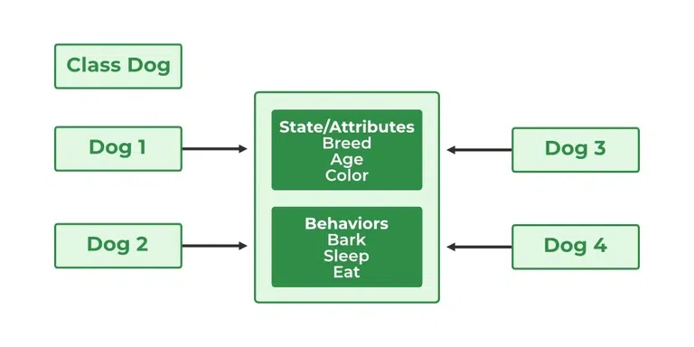

# 1.2.1 Classes and Objects

In Java, a **class** is a blueprint for creating objects. It encapsulates data for the object and methods to manipulate
that data.

**Objects** are instances of classes, and they represent real-world entities.

Understanding how to define and
instantiate classes is fundamental to object-oriented programming in Java.


---

<!-- TOC -->
* [1.2.1 Classes and Objects](#121-classes-and-objects)
    * [1.2.1.1 Class definition and instantiation](#1211-class-definition-and-instantiation)
      * [Class Definition or Declaration](#class-definition-or-declaration)
      * [Instantiation](#instantiation)
      * [Objects](#objects)
      * [Declaring Objects (Also called instantiating a class)](#declaring-objects-also-called-instantiating-a-class)
      * [Ways to Create an Object of a Class](#ways-to-create-an-object-of-a-class)
<!-- TOC -->

--- 

### 1.2.1.1 Class definition and instantiation

1. **Class Definition**:
    - A class is defined using the `class` keyword, followed by the class name and a pair of curly braces `{}` which
      contain the class members (fields and methods).
    - A class can contain:
        - **Fields** (attributes/properties) - Variables to hold data.
        - **Methods** - Functions that define the behavior of the class.

2. **Instantiation**:
    - Creating an instance (object) of a class is done using the `new` keyword followed by the class constructor.
    - Constructors are special methods called when an object is created, and they can be overloaded to provide multiple
      ways to instantiate a class.

3. **Access Modifiers**:
    - Java provides access modifiers (`public`, `private`, `protected`, and package-private) to control the visibility
      of class members.

4. **Encapsulation**:
    - This is the practice of bundling the data (fields) and methods that operate on the data into a single unit (
      class). It restricts direct access to some of an object’s components, which is a means of preventing unintended
      interference and misuse.

- **Properties of Java Classes**
    - Class is not a real-world entity. It is just a template or blueprint or prototype from which objects are created.
    - Class does not occupy memory.
    - Class is a group of variables of different data types and a group of methods.
    - A Class in Java can contain:
        - Data member
        - Method
        - Constructor
        - Nested Class
        - Interface

#### Class Definition or Declaration

**Syntax:**

```
access_modifier class <class_name>
{  
    data member;  
    method;  
    constructor;
    nested class;
    interface;
}
```

**Code Example:**

```java
public class Car {
    // Fields (attributes)
    private String make;
    private String model;
    private int year;

    // Constructor
    public Car(String make, String model, int year) {
        this.make = make;
        this.model = model;
        this.year = year;
    }

    // Method to display car details
    public void displayDetails() {
        System.out.println("Car Make: " + make);
        System.out.println("Car Model: " + model);
        System.out.println("Car Year: " + year);
    }
}
```

#### Instantiation

**Code Example:**

```java
public class Main {
    public static void main(String[] args) {
        // Creating an instance of the Car class
        Car myCar = new Car("Toyota", "Corolla", 2020);

        // Calling a method on the object
        myCar.displayDetails();
    }
}

```

#### Objects

An object in Java is a basic unit of Object-Oriented Programming and represents real-life entities. Objects are the
instances of a class that are created to use the attributes and methods of a class. A typical Java program creates many
objects, which as you know, interact by invoking methods. An object consists of :

1. **State:** It is represented by attributes of an object. It also reflects the properties of an object.
2. **Behavior:** It is represented by the methods of an object. It also reflects the response of an object with other
   objects.
3. **Identity:** It gives a unique name to an object and enables one object to interact with other objects.

Example of an object: dog:


Objects correspond to things found in the real world. For example, a graphics program may have objects such as “circle”,
“square”, and “menu”. An online shopping system might have objects such as “shopping cart”, “customer”, and “product”.

> **Note**: When we create an object which is a non primitive data type, it’s always allocated on the **heap memory**.

#### Declaring Objects (Also called instantiating a class)

When an object of a class is created, the class is said to be instantiated . All the instances share the attributes and
the behavior of the class. But the values of those attributes, i.e. the state are unique for each object. A single class
may have any number of instances.



**Code Example:**

```java
// Class Declaration
public class Dog {
    // Instance Variables
    String name;
    String breed;
    int age;
    String color;

    // Constructor Declaration of Class
    public Dog(String name, String breed, int age,
               String color) {
        this.name = name;
        this.breed = breed;
        this.age = age;
        this.color = color;
    }

    // method 1
    public String getName() {
        return name;
    }

    // method 2
    public String getBreed() {
        return breed;
    }

    // method 3
    public int getAge() {
        return age;
    }

    // method 4
    public String getColor() {
        return color;
    }

    @Override
    public String toString() {
        return ("Hi my name is " + this.getName()
                + ".\nMy breed,age and color are "
                + this.getBreed() + "," + this.getAge()
                + "," + this.getColor());
    }

    public static void main(String[] args) {
        Dog tuffy = new Dog("tuffy", "papillon", 5, "white");
        System.out.println(tuffy.toString());
    }
}
```

**Output:**

```
Hi my name is tuffy.
My breed,age and color are papillon,5,white
```

#### Ways to Create an Object of a Class

1. **Using new keyword**

   It is the most common and general way to create an object in Java.
    ```
   // creating object of class Test
    Test t = new Test();
    ```

