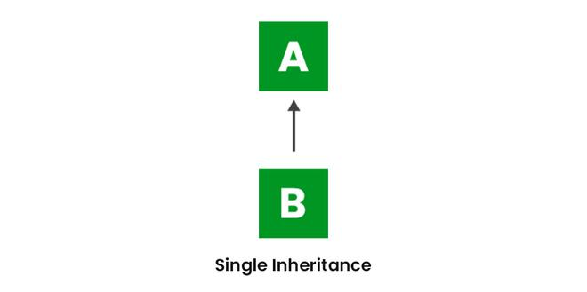

# 1.2.2 Inheritance

Java, Inheritance is an important pillar of OOP(Object-Oriented Programming). It is the mechanism in Java by which one
class is allowed to inherit the features(fields and methods) of another class. In Java, Inheritance means creating new
classes based on existing ones. A class that inherits from another class can reuse the methods and fields of that class.
In addition, you can add new fields and methods to your current class as well.

<!-- TOC -->
* [1.2.2 Inheritance](#122-inheritance)
  * [Inheritance Types](#inheritance-types)
    * [IS-A type of Relationship](#is-a-type-of-relationship)
    * [What Can Be Done in a Subclass?](#what-can-be-done-in-a-subclass)
    * [Advantages Of Inheritance in Java](#advantages-of-inheritance-in-java)
    * [Disadvantages of Inheritance in Java](#disadvantages-of-inheritance-in-java)
  * [1.2.2.1 Superclass and subclass](#1221-superclass-and-subclass)
    * [Superclass](#superclass)
    * [Subclass](#subclass)
    * [Code Example](#code-example)
    * [FAQs](#faqs)
  * [1.2.2.2 extends keyword](#1222-extends-keyword)
  * [1.2.2.3 Method overriding](#1223-method-overriding)
  * [1.2.2.4 super keyword](#1224-super-keyword)
<!-- TOC -->

## Inheritance Types

The different types of inheritance which are supported by Java.

* Single Inheritance
* Multilevel Inheritance
* Hierarchical Inheritance
* Multiple Inheritance
* Hybrid Inheritance

1. **Single Inheritance**

   In single inheritance, a sub-class is derived from only one super class. It inherits the properties and behavior of a
   single-parent class. Sometimes, it is also known as simple inheritance. In the below figure, ‘A’ is a parent class
   and ‘B’ is a child class. The class ‘B’ inherits all the properties of the class ‘A’.



```java
// Parent class
class One {
    public void printParent() {
        System.out.println("Parent One");
    }
}

// Child class
class Two extends One {
    public void printChild() {
        System.out.println("Child");
    }
}

public class Main {
    public static void main(String[] args) {
        Two g = new Two();
        g.printParent();
        g.printChild();
    }
}
```

2. **Multilevel Inheritance**

In Multilevel Inheritance, a derived class will be inheriting a base class, and as well as the derived class also acts
as the base class for other classes. In the below image, class A serves as a base class for the derived class B, which
in turn serves as a base class for the derived class C. In Java, a class cannot directly access the grandparent’s
members.


```java
// Grandparent class
class Grandparent {
    public void printGrandparent() {
        System.out.println("Grandparent class");
    }
}

// Parent class
class Parent extends Grandparent {
    public void printParent() {
        System.out.println("Parent class");
    }
}

// Child class
class Child extends Parent {
    public void printChild() {
        System.out.println("Child class");
    }
}

// Driver class
public class Main {
    public static void main(String[] args) {
        Child g = new Child();
        g.printGrandparent();
        g.printParent();
        g.printChild();
    }
}
```

3. **Hierarchical Inheritance**

In Hierarchical Inheritance, one class serves as a superclass (base class) for more than one subclass. In the below
image, class A serves as a base class for the derived classes B, C, and D.

```java
class A {
    public void print_A() {
        System.out.println("Class A");
    }
}

class B extends A {
    public void print_B() {
        System.out.println("Class B");
    }
}

class C extends A {
    public void print_C() {
        System.out.println("Class C");
    }
}

class D extends A {
    public void print_D() {
        System.out.println("Class D");
    }
}

public class Test {
    public static void main(String[] args) {
        B obj_B = new B();
        obj_B.print_A();
        obj_B.print_B();

        C obj_C = new C();
        obj_C.print_A();
        obj_C.print_C();

        D obj_D = new D();
        obj_D.print_A();
        obj_D.print_D();
    }
}
```


4. Multiple Inheritance (Through Interfaces)

In Multiple inheritances, one class can have more than one superclass and inherit features from all parent classes.
Please note that Java does not support multiple inheritances with classes. In Java, we can achieve multiple inheritances
only through Interfaces. In the image below, Class C is derived from interfaces A and B.


```java
interface One {
    public void print_geek();
}

interface Two {
    public void print_for();
}

interface Three extends One, Two {
    public void print_geek();
}

class Child implements Three {
    @Override
    public void print_geek() {
        System.out.println("Geeks");
    }

    public void print_for() {
        System.out.println("for");
    }
}

public class Main {
    public static void main(String[] args) {
        Child c = new Child();
        c.print_geek();
        c.print_for();
        c.print_geek();
    }
}
```

5. **Hybrid Inheritance**

It is a mix of two or more of the above types of inheritance. Since Java doesn’t support multiple inheritances with
classes, hybrid inheritance involving multiple inheritance is also not possible with classes. In Java, we can achieve
hybrid inheritance only through Interfaces if we want to involve multiple inheritance to implement Hybrid inheritance.
However, it is important to note that Hybrid inheritance does not necessarily require the use of Multiple Inheritance
exclusively. It can be achieved through a combination of Multilevel Inheritance and Hierarchical Inheritance with
classes, Hierarchical and Single Inheritance with classes. Therefore, it is indeed possible to implement Hybrid
inheritance using classes alone, without relying on multiple inheritance type.


### IS-A type of Relationship

IS-A is a way of saying: This object is a type of that object. Let us see how the extends keyword is used to achieve
inheritance.

```java
public class SolarSystem {
}

public class Earth extends SolarSystem {
}

public class Mars extends SolarSystem {
}

public class Moon extends Earth {
}
```

Now, based on the above example, in Object-Oriented terms, the following are true:-

* SolarSystem is the superclass of Earth class.
* SolarSystem is the superclass of Mars class.
* Earth and Mars are subclasses of SolarSystem class.
* Moon is the subclass of both Earth and SolarSystem classes.

### What Can Be Done in a Subclass?

In sub-classes we can inherit members as is, replace them, hide them, or supplement them with new members:

* The inherited fields can be used directly, just like any other fields.
* We can declare new fields in the subclass that are not in the superclass.
* The inherited methods can be used directly as they are.
* We can write a new instance method in the subclass that has the same signature as the one in the superclass, thus
  overriding it (as in the example above, toString() method is overridden).
* We can write a new static method in the subclass that has the same signature as the one in the superclass, thus hiding
  it.
* We can declare new methods in the subclass that are not in the superclass.
* We can write a subclass constructor that invokes the constructor of the superclass, either implicitly or by using the
  keyword super.

### Advantages Of Inheritance in Java

* **Code Reusability:** Inheritance allows for code reuse and reduces the amount of code that needs to be written. The
  subclass can reuse the properties and methods of the superclass, reducing duplication of code.
* **Abstraction:** Inheritance allows for the creation of abstract classes that define a common interface for a group of
  related classes. This promotes abstraction and encapsulation, making the code easier to maintain and extend.
* **Class Hierarchy:** Inheritance allows for the creation of a class hierarchy, which can be used to model real-world
  objects and their relationships.
* **Polymorphism:** Inheritance allows for polymorphism, which is the ability of an object to take on multiple forms.
  Subclasses can override the methods of the superclass, which allows them to change their behavior in different ways.

### Disadvantages of Inheritance in Java

* **Complexity:** Inheritance can make the code more complex and harder to understand. This is especially true if the
  inheritance hierarchy is deep or if multiple inheritances is used.
* **Tight Coupling:** Inheritance creates a tight coupling between the superclass and subclass, making it difficult to
  make changes to the superclass without affecting the subclass.

--- 

## 1.2.2.1 Superclass and subclass

### Superclass

A superclass, also known as a parent class or base class, is a class that provides common attributes and behaviors which
can be inherited by its subclasses. It forms the top or the higher level of a class hierarchy.

**Key Characteristics of a Superclass:**

- **Code Reusability:** By defining common functionalities in a superclass, subclasses can inherit these
  functionalities,
  reducing redundancy.
- **Encapsulation of Common Features:** Superclasses encapsulate the shared features of subclasses, making the codebase
  more
  organized and easier to manage.
- **Inheritance of Members:** All non-private fields and methods of a superclass are inherited by subclasses. This
  includes
  protected and public members.

### Subclass

A subclass, also known as a child class or derived class, inherits fields and methods from a superclass. It can extend
the functionality of the superclass by adding new fields and methods or overriding existing ones.

**Key Characteristics of a Subclass:**

- **Inheritance of Features:** The subclass inherits non-private fields and methods from its superclass.
- **Extension of Functionality:** It can add new methods and fields or override superclass methods to provide specific
  behavior.
- **Single Inheritance:** In Java, a subclass can inherit from only one superclass, but it can implement multiple
  interfaces.

### Code Example

```java
// Parent class
class Employee {
    String name;
    int employeeId;

    void work() {
        System.out.println(name + " is working.");
    }
}

// Child class
class Manager extends Employee {
    int teamSize;

    @Override
    void work() {
        System.out.println(name + " is managing a team of " + teamSize + " people.");
    }

    void conductMeeting() {
        System.out.println(name + " is conducting a meeting.");
    }
}

public class Main {
    public static void main(String[] args) {
        Manager manager = new Manager();
        manager.name = "Alice";
        manager.employeeId = 101;
        manager.teamSize = 5;

        manager.work(); // Overridden method
        manager.conductMeeting(); // Subclass-specific method
    }
}
```

In this example, Manager is a subclass of Employee. It overrides the work() method and introduces a new method
conductMeeting().

### FAQs

1. **Can a subclass inherit constructors from its superclass?**

   No, constructors are not inherited by subclasses in Java. However, a subclass can call a superclass constructor using
   the super() keyword to initialize the inherited fields.

2. **What is the difference between overriding and overloading in the context of subclasses?**

    - **Overriding** refers to a subclass providing a specific implementation for a method already defined in its
      superclass. It involves the same method name and parameters.
    - **Overloading** refers to defining multiple methods with the same name but different parameter lists within the
      same class or subclass.

3. **Can a subclass override private methods of its superclass?**

   No, private methods are not visible to subclasses and cannot be overridden. However, a subclass can define a method
   with the same name, but it is not considered overriding.

4. **Is it possible for a subclass to access the private fields of its superclass?**

   No, private fields of a superclass are not directly accessible by its subclasses. However, subclasses can access
   these fields through public or protected getter and setter methods provided by the superclass.

5. **Can a superclass be abstract, and if so, what does it imply for the subclass?**

   Yes, a superclass can be abstract. This means it may contain abstract methods (methods without implementations) that
   must be implemented by any concrete subclass. An abstract class cannot be instantiated directly.

---

## 1.2.2.2 extends keyword

---

## 1.2.2.3 Method overriding

---

## 1.2.2.4 super keyword
