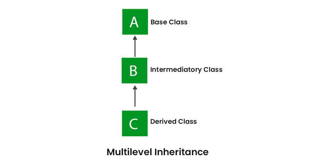

# 1.2.2 Inheritance

Java, Inheritance is an important pillar of OOP(Object-Oriented Programming). It is the mechanism in Java by which one
class is allowed to inherit the features(fields and methods) of another class. In Java, Inheritance means creating new
classes based on existing ones. A class that inherits from another class can reuse the methods and fields of that class.
In addition, you can add new fields and methods to your current class as well.

<!-- TOC -->
* [1.2.2 Inheritance](#122-inheritance)
  * [Inheritance Types](#inheritance-types)
  * [IS-A type of Relationship](#is-a-type-of-relationship)
  * [What Can Be Done in a Subclass?](#what-can-be-done-in-a-subclass)
  * [Advantages Of Inheritance in Java](#advantages-of-inheritance-in-java)
  * [Disadvantages of Inheritance in Java](#disadvantages-of-inheritance-in-java)
  * [FAQs](#faqs)
  * [1.2.2.1 Superclass and Subclass](#1221-superclass-and-subclass)
    * [Superclass](#superclass)
    * [Subclass](#subclass)
    * [Code Example](#code-example)
    * [FAQs](#faqs-1)
  * [1.2.2.2 Extends Keyword](#1222-extends-keyword)
    * [Key Features of the extends Keyword](#key-features-of-the-extends-keyword)
    * [FAQs](#faqs-2)
  * [1.2.2.3 Method Overriding](#1223-method-overriding)
    * [Key Characteristics](#key-characteristics)
    * [FAQs](#faqs-3)
  * [1.2.2.4 Super Keyword](#1224-super-keyword)
    * [Key Uses](#key-uses)
    * [FAQs](#faqs-4)
<!-- TOC -->

## Inheritance Types

The different types of inheritance which are supported by Java.

* Single Inheritance
* Multilevel Inheritance
* Hierarchical Inheritance
* Multiple Inheritance
* Hybrid Inheritance

1. **Single Inheritance**

   In single inheritance, a sub-class is derived from only one super class. It inherits the properties and behavior of a
   single-parent class. Sometimes, it is also known as simple inheritance. In the below figure, ‘A’ is a parent class
   and ‘B’ is a child class. The class ‘B’ inherits all the properties of the class ‘A’.


```java
// Parent class
class One {
    public void printParent() {
        System.out.println("Parent One");
    }
}

// Child class
class Two extends One {
    public void printChild() {
        System.out.println("Child");
    }
}

public class Main {
    public static void main(String[] args) {
        Two g = new Two();
        g.printParent();
        g.printChild();
    }
}
```

2. **Multilevel Inheritance**

In Multilevel Inheritance, a derived class will be inheriting a base class, and as well as the derived class also acts
as the base class for other classes. In the below image, class A serves as a base class for the derived class B, which
in turn serves as a base class for the derived class C. In Java, a class cannot directly access the grandparent’s
members.



```java
// Grandparent class
class Grandparent {
    public void printGrandparent() {
        System.out.println("Grandparent class");
    }
}

// Parent class
class Parent extends Grandparent {
    public void printParent() {
        System.out.println("Parent class");
    }
}

// Child class
class Child extends Parent {
    public void printChild() {
        System.out.println("Child class");
    }
}

// Driver class
public class Main {
    public static void main(String[] args) {
        Child g = new Child();
        g.printGrandparent();
        g.printParent();
        g.printChild();
    }
}
```

3. **Hierarchical Inheritance**

In Hierarchical Inheritance, one class serves as a superclass (base class) for more than one subclass. In the below
image, class A serves as a base class for the derived classes B, C, and D.

```java
class A {
    public void print_A() {
        System.out.println("Class A");
    }
}

class B extends A {
    public void print_B() {
        System.out.println("Class B");
    }
}

class C extends A {
    public void print_C() {
        System.out.println("Class C");
    }
}

class D extends A {
    public void print_D() {
        System.out.println("Class D");
    }
}

public class Test {
    public static void main(String[] args) {
        B obj_B = new B();
        obj_B.print_A();
        obj_B.print_B();

        C obj_C = new C();
        obj_C.print_A();
        obj_C.print_C();

        D obj_D = new D();
        obj_D.print_A();
        obj_D.print_D();
    }
}
```


4. Multiple Inheritance (Through Interfaces)

In Multiple inheritances, one class can have more than one superclass and inherit features from all parent classes.
Please note that Java does not support multiple inheritances with classes. In Java, we can achieve multiple inheritances
only through Interfaces. In the image below, Class C is derived from interfaces A and B.


```java
interface One {
    public void print_geek();
}

interface Two {
    public void print_for();
}

interface Three extends One, Two {
    public void print_geek();
}

class Child implements Three {
    @Override
    public void print_geek() {
        System.out.println("Geeks");
    }

    public void print_for() {
        System.out.println("for");
    }
}

public class Main {
    public static void main(String[] args) {
        Child c = new Child();
        c.print_geek();
        c.print_for();
        c.print_geek();
    }
}
```

5. **Hybrid Inheritance**

It is a mix of two or more of the above types of inheritance. Since Java doesn’t support multiple inheritances with
classes, hybrid inheritance involving multiple inheritance is also not possible with classes. In Java, we can achieve
hybrid inheritance only through Interfaces if we want to involve multiple inheritance to implement Hybrid inheritance.
However, it is important to note that Hybrid inheritance does not necessarily require the use of Multiple Inheritance
exclusively. It can be achieved through a combination of Multilevel Inheritance and Hierarchical Inheritance with
classes, Hierarchical and Single Inheritance with classes. Therefore, it is indeed possible to implement Hybrid
inheritance using classes alone, without relying on multiple inheritance type.


## IS-A type of Relationship

IS-A is a way of saying: This object is a type of that object. Let us see how the extends keyword is used to achieve
inheritance.

```java
public class SolarSystem {
}

public class Earth extends SolarSystem {
}

public class Mars extends SolarSystem {
}

public class Moon extends Earth {
}
```

Now, based on the above example, in Object-Oriented terms, the following are true:-

* SolarSystem is the superclass of Earth class.
* SolarSystem is the superclass of Mars class.
* Earth and Mars are subclasses of SolarSystem class.
* Moon is the subclass of both Earth and SolarSystem classes.

## What Can Be Done in a Subclass?

In sub-classes we can inherit members as is, replace them, hide them, or supplement them with new members:

* The inherited fields can be used directly, just like any other fields.
* We can declare new fields in the subclass that are not in the superclass.
* The inherited methods can be used directly as they are.
* We can write a new instance method in the subclass that has the same signature as the one in the superclass, thus
  overriding it (as in the example above, toString() method is overridden).
* We can write a new static method in the subclass that has the same signature as the one in the superclass, thus hiding
  it.
* We can declare new methods in the subclass that are not in the superclass.
* We can write a subclass constructor that invokes the constructor of the superclass, either implicitly or by using the
  keyword super.

## Advantages Of Inheritance in Java

* **Code Reusability:** Inheritance allows for code reuse and reduces the amount of code that needs to be written. The
  subclass can reuse the properties and methods of the superclass, reducing duplication of code.
* **Abstraction:** Inheritance allows for the creation of abstract classes that define a common interface for a group of
  related classes. This promotes abstraction and encapsulation, making the code easier to maintain and extend.
* **Class Hierarchy:** Inheritance allows for the creation of a class hierarchy, which can be used to model real-world
  objects and their relationships.
* **Polymorphism:** Inheritance allows for polymorphism, which is the ability of an object to take on multiple forms.
  Subclasses can override the methods of the superclass, which allows them to change their behavior in different ways.

## Disadvantages of Inheritance in Java

* **Complexity:** Inheritance can make the code more complex and harder to understand. This is especially true if the
  inheritance hierarchy is deep or if multiple inheritances is used.
* **Tight Coupling:** Inheritance creates a tight coupling between the superclass and subclass, making it difficult to
  make changes to the superclass without affecting the subclass.

## FAQs

1. **What is single inheritance in Java?**

   Single inheritance in Java occurs when a class (subclass) inherits from only one superclass. It allows the subclass
   to inherit properties and behaviors from a single parent class, promoting code reuse and a simple class hierarchy.

2. **How does multilevel inheritance work, and can a class access its grandparent's members directly?**

   Multilevel inheritance involves a chain of inheritance where a derived class inherits from another derived class. For
   example, Class C can inherit from Class B, which in turn inherits from Class A. In Java, a class cannot access its
   grandparent's members directly unless they are public or accessible through inherited methods.

3. **What is hierarchical inheritance, and how does it differ from multilevel inheritance?**

   Hierarchical inheritance occurs when a single class (superclass) serves as a base for multiple subclasses. Each
   subclass independently inherits from the same superclass. This differs from multilevel inheritance, where inheritance
   forms a chain from one class to another.

4. **Why does Java not support multiple inheritance with classes, and how is it achieved?**

   Java does not support multiple inheritance with classes to prevent the "diamond problem," which creates ambiguity
   regarding inherited properties. However, multiple inheritance is achieved in Java through interfaces, allowing a
   class to implement multiple interfaces.

5. **What is hybrid inheritance, and can it be implemented in Java?**

   Hybrid inheritance is a combination of two or more types of inheritance (e.g., single, multilevel, hierarchical). In
   Java, hybrid inheritance can be achieved through interfaces, even though Java doesn't support multiple inheritance
   with classes. It can also be implemented using a mix of multilevel and hierarchical inheritance with classes.

6. **What does the IS-A relationship signify in Java, and how is it achieved?**

   The IS-A relationship signifies inheritance in Java, indicating that one class is a type of another. It is achieved
   using the `extends` keyword for classes and `implements` for interfaces, establishing a parent-child relationship.

7. **What operations can be performed in a subclass in Java?**

   A subclass in Java can:

    - Inherit fields and methods directly.
    - Declare new fields and methods.
    - Override inherited methods to provide specific implementations.
    - Hide static methods by redeclaring them with the same signature.
    - Call superclass constructors using `super()`.

8. **What are the advantages of using inheritance in Java?**

   Inheritance in Java offers several advantages:

    - **Code Reusability:** Reduces code duplication by reusing superclass attributes and methods.
    - **Abstraction:** Facilitates abstract class creation, promoting encapsulation and easier maintenance.
    - **Class Hierarchy:** Models real-world relationships and objects through class hierarchies.
    - **Polymorphism:** Allows subclasses to override methods, enabling dynamic behavior changes.

9. **What are the potential disadvantages of using inheritance in Java?**

   Some potential disadvantages include:

    - **Complexity:** Deep inheritance hierarchies can complicate code understanding and maintenance.

--- 

## 1.2.2.1 Superclass and Subclass

### Superclass

A superclass, also known as a parent class or base class, is a class that provides common attributes and behaviors which
can be inherited by its subclasses. It forms the top or the higher level of a class hierarchy.

**Key Characteristics of a Superclass:**

- **Code Reusability:** By defining common functionalities in a superclass, subclasses can inherit these
  functionalities,
  reducing redundancy.
- **Encapsulation of Common Features:** Superclasses encapsulate the shared features of subclasses, making the codebase
  more
  organized and easier to manage.
- **Inheritance of Members:** All non-private fields and methods of a superclass are inherited by subclasses. This
  includes
  protected and public members.

### Subclass

A subclass, also known as a child class or derived class, inherits fields and methods from a superclass. It can extend
the functionality of the superclass by adding new fields and methods or overriding existing ones.

**Key Characteristics of a Subclass:**

- **Inheritance of Features:** The subclass inherits non-private fields and methods from its superclass.
- **Extension of Functionality:** It can add new methods and fields or override superclass methods to provide specific
  behavior.
- **Single Inheritance:** In Java, a subclass can inherit from only one superclass, but it can implement multiple
  interfaces.

### Code Example

```java
// Parent class
class Employee {
    String name;
    int employeeId;

    void work() {
        System.out.println(name + " is working.");
    }
}

// Child class
class Manager extends Employee {
    int teamSize;

    @Override
    void work() {
        System.out.println(name + " is managing a team of " + teamSize + " people.");
    }

    void conductMeeting() {
        System.out.println(name + " is conducting a meeting.");
    }
}

public class Main {
    public static void main(String[] args) {
        Manager manager = new Manager();
        manager.name = "Alice";
        manager.employeeId = 101;
        manager.teamSize = 5;

        manager.work(); // Overridden method
        manager.conductMeeting(); // Subclass-specific method
    }
}
```

In this example, Manager is a subclass of Employee. It overrides the work() method and introduces a new method
conductMeeting().

### FAQs

1. **Can a subclass inherit constructors from its superclass?**

   No, constructors are not inherited by subclasses in Java. However, a subclass can call a superclass constructor using
   the super() keyword to initialize the inherited fields.

2. **What is the difference between overriding and overloading in the context of subclasses?**

    - **Overriding** refers to a subclass providing a specific implementation for a method already defined in its
      superclass. It involves the same method name and parameters.
    - **Overloading** refers to defining multiple methods with the same name but different parameter lists within the
      same class or subclass.

3. **Can a subclass override private methods of its superclass?**

   No, private methods are not visible to subclasses and cannot be overridden. However, a subclass can define a method
   with the same name, but it is not considered overriding.

4. **Is it possible for a subclass to access the private fields of its superclass?**

   No, private fields of a superclass are not directly accessible by its subclasses. However, subclasses can access
   these fields through public or protected getter and setter methods provided by the superclass.

5. **Can a superclass be abstract, and if so, what does it imply for the subclass?**

   Yes, a superclass can be abstract. This means it may contain abstract methods (methods without implementations) that
   must be implemented by any concrete subclass. An abstract class cannot be instantiated directly.

---

## 1.2.2.2 Extends Keyword

The extends keyword is a fundamental part of Java's inheritance model. It allows one class (the subclass) to inherit
fields and methods from another class (the superclass). This promotes code reusability, logical class hierarchies, and
polymorphism.

**How Inheritance Works with extends**

When a class is declared using the extends keyword, it gains access to all non-private fields and methods of the
superclass. The subclass can then use these inherited members and, if necessary, override them to provide specific
behavior.

**Syntax:**

```java
class SubclassName extends SuperclassName {
    // additional fields and methods specific to the subclass
}
```

### Key Features of the extends Keyword

1. **Single Inheritance:**

   Java supports single inheritance, meaning a subclass can extend only one superclass at a time. This design choice
   simplifies the language and avoids the pitfalls of multiple inheritance, such as the diamond problem.

2. **Access to Superclass Members:**

    - **Public Members:** Fully accessible.
    - **Protected Members:** Accessible within the same package or through inheritance.
    - **Private Members:** Not directly accessible but can be accessed through public or protected methods provided by
      the superclass.
    - **Default (Package-Private) Members:** Accessible only within the same package.

3. **Overriding Methods:**

   Subclasses can override the methods of the superclass to change their behavior. This is done by providing a new
   implementation with the same method signature.

4. **Constructor Chaining:**

   Subclasses do not inherit constructors, but they can call the superclass constructor using the _**super**_() keyword,
   usually as the first line in the subclass constructor.

**Example:**

```java
// Superclass
class Animal {
    void eat() {
        System.out.println("This animal eats food.");
    }
}

// Subclass
class Dog extends Animal {
    @Override
    void eat() {
        System.out.println("The dog eats kibble.");
    }

    void bark() {
        System.out.println("The dog barks.");
    }
}

public class Main {
    public static void main(String[] args) {
        Dog myDog = new Dog();
        myDog.eat(); // Calls the overridden method
        myDog.bark(); // Calls the subclass-specific method
    }
}
```

### FAQs

1. **Can a class extend multiple classes in Java?**

   No, Java does not support multiple inheritance, meaning a class cannot extend more than one class simultaneously.
   This is to avoid ambiguity and complexity inherent in multiple inheritance.

2. **How does the extends keyword relate to interfaces?**

   While a class can extend only one class, it can implement multiple interfaces. Interfaces are used to achieve
   abstraction and multiple inheritance (in terms of type), allowing a class to inherit behavior from multiple sources.

3. **What happens if a subclass does not override a method of its superclass?**

   If a subclass does not override a method inherited from its superclass, it will inherit the method as is. The
   subclass can use the method without any changes unless specific behavior is required.

4. **Can a subclass access private fields of its superclass directly?**

   No, private fields are not accessible directly by subclasses. They can be accessed indirectly through public or
   protected methods provided by the superclass, such as getters and setters.

5. **Is it mandatory for a subclass to call the superclass constructor?**

   Yes, if a superclass does not have a no-argument constructor, the subclass must explicitly call one of the
   superclass' constructors using super(). If there's no explicit call to a superclass constructor, Java will
   automatically insert a call to the no-argument constructor, if available.

6. **Can a subclass have additional fields and methods beyond those inherited from the superclass?**

   Yes, a subclass can define its own fields and methods in addition to those inherited from the superclass. This allows
   the subclass to extend its functionality beyond what is provided by the superclass.

---

## 1.2.2.3 Method Overriding

Method overriding is a key feature of object-oriented programming that allows a subclass to provide a specific
implementation of a method that is already defined in its superclass. This is central to achieving runtime polymorphism
in Java, where the method call is resolved at runtime based on the object's actual type.

### Key Characteristics

1. **Inheritance Requirement:**

   Method overriding can only occur in an inheritance hierarchy. The overriding method in the subclass must have the
   same name, return type, and parameters as the method in the superclass.

2. **Access Modifiers:**

   The access level of the overriding method cannot be more restrictive than that of the overridden method. For
   instance, if the superclass method is public, the subclass method must also be public.

3. **Return Type:**

   The return type of the overriding method must be the same or a subtype (covariant return type) of the overridden
   method's return type.

4. **Annotations:**

   It is a good practice to use the @Override annotation above the overriding method. This helps the compiler and
   developers identify that a method is intended to override a superclass method.

5. **Invocation:**

   To call the overridden method of the superclass from the subclass, the super keyword is used.

**Example:**

```java
// Superclass
class Animal {
    void makeSound() {
        System.out.println("Animal makes a sound");
    }
}

// Subclass
class Dog extends Animal {
    @Override
    void makeSound() {
        System.out.println("Dog barks");
    }
}

public class Main {
    public static void main(String[] args) {
        Animal myAnimal = new Dog();
        myAnimal.makeSound(); // Outputs: Dog barks
    }
}
```

### FAQs

1. **What is the difference between method overloading and method overriding?**

    - **Method Overloading**: Occurs within the same class and involves methods with the same name but different
      parameter
      lists (type, number, or both). It is resolved at compile time.
    - **Method Overriding**: Involves a subclass providing a specific implementation for a method defined in its
      superclass.
      It is resolved at runtime.

2. **Can static methods be overridden?**

   No, static methods cannot be overridden because they belong to the class, not the instance. However, they can be
   hidden if a subclass defines a static method with the same signature as a static method in the superclass.

3. **Is it possible to override a private method?**

   No, private methods are not visible to subclasses and cannot be overridden. They are accessible only within the class
   they are defined in.

4. **Can constructors be overridden?**

   No, constructors cannot be overridden. They are not inherited in the subclass, and each class has its own
   constructors.

5. **What is a covariant return type in method overriding?**

   A covariant return type allows the overriding method to return a subtype of the object returned by the overridden
   method. This feature was introduced in Java 5 to enhance flexibility in method overriding.

6. **What happens if you use the @Override annotation incorrectly?**

   If the @Override annotation is used incorrectly (e.g., on a method that does not override a superclass method), the
   compiler will generate an error. This helps catch mistakes early in the development process.

7. **How can you invoke a superclass method that has been overridden in the subclass?**

   To invoke a superclass method from a subclass that has overridden it, use the super keyword, like so:
   super.methodName();.

---

## 1.2.2.4 Super Keyword

The super keyword in Java is an essential tool for managing inheritance. It allows a subclass to access methods and
constructors from its superclass, facilitating method overriding and constructor chaining.

### Key Uses

1. **Accessing Superclass Methods:**

   The super keyword can be used to call a method defined in the superclass that has been overridden in the subclass.
   This is useful when you want to extend or modify the behavior of a superclass method while still retaining its
   original functionality.

2. **Invoking Superclass Constructors:**

   The super() call can be used within a subclass constructor to invoke a constructor of the superclass. This is
   important for ensuring that the superclass is initialized before the subclass adds its specific initializations. If
   super() is not explicitly called, the default constructor of the superclass is called implicitly.

3. **Accessing Superclass Fields:**

   If a field is hidden by a field in the subclass (i.e., the subclass has a field with the same name), the super
   keyword can be used to refer to the superclass version of the field.

**Examples**

**Accessing Superclass Methods:**

```java
class Animal {
    void makeSound() {
        System.out.println("Animal sound");
    }
}

class Dog extends Animal {
    @Override
    void makeSound() {
        super.makeSound();  // Calls the superclass method
        System.out.println("Dog barks");
    }
}
```

In this example, super.makeSound() calls the makeSound() method of Animal before executing the additional behavior
defined in Dog.

**Invoking Superclass Constructors:**

```java
class Vehicle {
    Vehicle() {
        System.out.println("Vehicle is created");
    }
}

class Car extends Vehicle {
    Car() {
        super();  // Calls the constructor of Vehicle
        System.out.println("Car is created");
    }
}
```

Here, super() in Car's constructor ensures that Vehicle's constructor is executed first, setting up any necessary
initialization for Vehicle.

### FAQs

1. **When must super() be the first statement in a constructor?**

   super() must be the first statement in a subclass constructor if you want to explicitly call a superclass
   constructor. This ensures that the superclass is properly initialized before the subclass adds its specific
   initializations.

2. **Can super be used to access private members of the superclass?**

   No, super cannot be used to access private members of the superclass. Private members are not visible to subclasses
   and can only be accessed within the class they are declared.

3. **What happens if you do not use super() in a subclass constructor?**

   If super() is not used, the Java compiler automatically inserts a call to the no-argument constructor of the
   superclass. If the superclass does not have a no-argument constructor, a compilation error will occur unless you
   explicitly call another constructor.

4. **Can super be used in static methods?**

   No, super cannot be used in static contexts, such as static methods or static blocks, because super is related to
   instance-level inheritance and static methods do not belong to any instance.

5. **How does super differ from this?**

    - **super** is used to refer to the immediate superclass and can be used to call superclass methods and
      constructors.
    - **this** is used to refer to the current instance of the class and is commonly used to resolve naming conflicts or
      to call another constructor within the same class.

6. **Can super be used to call a method in a superclass that has not been overridden?**

   Yes, super can be used to call any accessible method in the superclass, whether it is overridden or not. However, it
   is typically used to access overridden methods specifically.