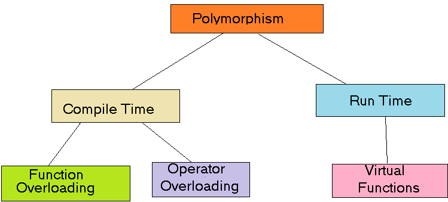

# 1.2.3 Polymorphism

The word ‘polymorphism’ means ‘having many forms’. In simple words, we can define Java Polymorphism as the ability of a
message to be displayed in more than one form.



<!-- TOC -->
* [1.2.3 Polymorphism](#123-polymorphism)
  * [What is Polymorphism in Java?](#what-is-polymorphism-in-java)
  * [Key Concepts](#key-concepts)
  * [Types of Java Polymorphism](#types-of-java-polymorphism)
    * [Compile-Time Polymorphism](#compile-time-polymorphism)
    * [Runtime Polymorphism in Java](#runtime-polymorphism-in-java)
  * [Advantages of Polymorphism in Java](#advantages-of-polymorphism-in-java)
  * [Disadvantages of Polymorphism in Java](#disadvantages-of-polymorphism-in-java)
* [1.2.3.1 Method overloading(Compile-Time Polymorphism)](#1231-method-overloadingcompile-time-polymorphism)
  * [FAQs](#faqs)
* [1.2.3.2 Method overriding(Runtime Polymorphism)](#1232-method-overridingruntime-polymorphism)
  * [FAQs](#faqs-1)
* [1.2.3.3 Upcasting and Downcasting](#1233-upcasting-and-downcasting)
  * [FAQs](#faqs-2)
<!-- TOC -->

## What is Polymorphism in Java?

Polymorphism is considered one of the important features of Object-Oriented Programming. Polymorphism allows us to
perform a single action in different ways. In other words, polymorphism allows you to define one interface and have
multiple implementations. The word “poly” means many and “morphs” means forms, So it means many forms.

## Key Concepts

1. **Definition:** Polymorphism is derived from the Greek words "poly" (meaning many) and "morph" (meaning form). It
   refers to the ability of different classes to be treated as instances of the same class through a common interface.

2. **Types of Polymorphism:**

    - **Compile-time Polymorphism (Static Polymorphism):** Achieved through method overloading and operator overloading.
    - **Runtime Polymorphism (Dynamic Polymorphism):** Achieved through method overriding.

3. **Benefits:**

    - **Code reusability:** Allows for code to be reused across different classes.
    - **Flexibility:** Makes it easier to extend and maintain code.

## Types of Java Polymorphism

In Java Polymorphism is mainly divided into two types:

* Compile-time Polymorphism
* Runtime Polymorphism

### Compile-Time Polymorphism

It is also known as static polymorphism. This type of polymorphism is achieved by function overloading or operator
overloading.

> Note: But Java doesn’t support the Operator Overloading.

**Method Overloading**

When there are multiple functions with the same name but different parameters then these functions are said to be
overloaded. Functions can be overloaded by changes in the number of arguments or/and a change in the type of arguments.

```java
class Helper {

    // Method with 2 integer parameters
    static int Multiply(int a, int b) {
        // Returns product of integer numbers
        return a * b;
    }

    // Method 2
    // With same name but with 2 double parameters
    static double Multiply(double a, double b) {
        // Returns product of double numbers
        return a * b;
    }
}


class GFG {
    public static void main(String[] args) {
        System.out.println(Helper.Multiply(2, 4)); // 8
        System.out.println(Helper.Multiply(5.5, 6.3)); // 42
    }
}
```

### Runtime Polymorphism in Java

It is also known as Dynamic Method Dispatch. It is a process in which a function call to the overridden method is
resolved at Runtime. This type of polymorphism is achieved by Method Overriding. Method overriding, on the other hand,
occurs when a derived class has a definition for one of the member functions of the base class. That base function is
said to be overridden.

```java
class Parent {

    void Print() {
        System.out.println("parent class");
    }
}

class subclass1 extends Parent {
    @Override
    void Print() {
        System.out.println("subclass1");
    }
}

class subclass2 extends Parent {
    @Override
    void Print() {
        System.out.println("subclass2");
    }
}

class GFG {

    public static void main(String[] args) {
        Parent a;
        // Now we will be calling print methods
        // inside main() method
        a = new subclass1();
        a.Print(); // subclass1
        a = new subclass2();
        a.Print(); // subclass2
    }
}
```

## Advantages of Polymorphism in Java

* Increases code reusability by allowing objects of different classes to be treated as objects of a common class.
* Improves readability and maintainability of code by reducing the amount of code that needs to be written and
  maintained.
* Supports dynamic binding, enabling the correct method to be called at runtime, based on the actual class of the
  object.
* Enables objects to be treated as a single type, making it easier to write generic code that can handle objects of
  different types.

## Disadvantages of Polymorphism in Java

* Can make it more difficult to understand the behavior of an object, especially if the code is complex.
* This may lead to performance issues, as polymorphic behavior may require additional computations at runtime.

# 1.2.3.1 Method overloading(Compile-Time Polymorphism)

Method overloading is a type of polymorphism where multiple methods in the same class have the same name but different
parameters (different types or number of parameters). It can also involve different return types, but the parameter list
must differ.

**Syntax:**

```java
class Example {
    int calculate(int a) {
        return a * a; // Returns square of a
    }

    double calculate(double a) {
        return a * a * a; // Returns cube of a
    }

    String calculate(String str) {
        return str + str; // Returns string concatenated with itself
    }
}
```

**Code Example:**

```java
public class OverloadingExample {
    public static void main(String[] args) {
        Example example = new Example();

        int square = example.calculate(5); // Calls calculate(int a)
        double cube = example.calculate(2.5); // Calls calculate(double a)
        String repeated = example.calculate("Hello"); // Calls calculate(String str)

        System.out.println("Square: " + square);
        System.out.println("Cube: " + cube);
        System.out.println("Repeated: " + repeated);
    }
}
```

## FAQs

1. **What is method overloading?**

   Method overloading allows multiple methods to have the same name with different parameter lists.

2. **Can method overloading occur in the same class only?**

   No, method overloading can also occur in subclasses.

3. **Is method overloading related to polymorphism?**

   Yes, it is a compile-time polymorphism mechanism.

4. **Can two overloaded methods have the same parameter types but different return types?**

   No, changing only the return type is not sufficient for overloading. The parameter list must differ in terms of type
   or number of parameters.

5. **Can methods with different return types be overloaded?**

   Yes, methods can be overloaded if they have the same name but differ in their parameter lists (type or number).

---

# 1.2.3.2 Method overriding(Runtime Polymorphism)

Method overriding occurs when a subclass provides a specific implementation of a method that is already defined in its
superclass.

**Syntax:**

```java
class Parent {
    void display() {
        System.out.println("Display from Parent");
    }
}

class Child extends Parent {
    @Override
    void display() {
        System.out.println("Display from Child");
    }
}
```

**Code Example:**

```java
public class OverridingExample {
    public static void main(String[] args) {
        Parent obj = new Child();
        obj.display(); // Calls Child's display() method
    }
}
```

## FAQs

1. **What is method overriding?**

   It is when a subclass provides a specific implementation of a method that is already defined in its superclass.

2. **Is method overriding a compile-time or runtime polymorphism?**

   Method overriding is an example of runtime polymorphism.

3. **Can you override a static method?**

   No, static methods cannot be overridden; they can be hidden.

---

# 1.2.3.3 Upcasting and Downcasting

**Upcasting** is the process of converting a subclass reference into a superclass reference.

**Downcasting** is converting a superclass reference back to a subclass reference.

**Code Example:**

```java
class Animal {
    void sound() {
        System.out.println("Animal makes sound");
    }
}

class Dog extends Animal {
    void sound() {
        System.out.println("Dog barks");
    }
}

public class CastingExample {
    public static void main(String[] args) {
        Animal myDog = new Dog(); // Upcasting
        myDog.sound(); // Outputs: Dog barks

        Dog dog = (Dog) myDog; // Downcasting
        dog.sound(); // Outputs: Dog barks
    }
}
```

## FAQs

1. **What is upcasting?**

   Upcasting is converting a subclass reference to a superclass reference.

2. **What is downcasting?**

   Downcasting is converting a superclass reference back to a subclass reference.

3. **Is downcasting safe?**

   Downcasting can lead to a ClassCastException if the object being cast is not an instance of the subclass.


