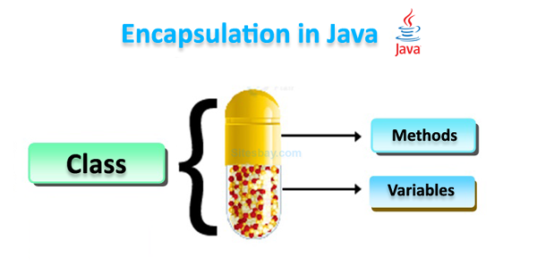

# 1.2.4 Encapsulation

Encapsulation in Java is a fundamental concept in object-oriented programming (OOP) that refers to the bundling of data
and methods that operate on that data within a single unit, which is called a class in Java. Java Encapsulation is a way
of hiding the implementation details of a class from outside access and only exposing a public interface that can be
used to interact with the class.



By using encapsulation, developers can control the access to the data and ensure that it is not modified directly from
outside the class. This leads to greater security and flexibility in the code.

<!-- TOC -->
* [1.2.4 Encapsulation](#124-encapsulation)
  * [Key Concepts](#key-concepts)
  * [Syntax](#syntax)
* [1.2.4.1 Access modifiers (private, protected, public, default)](#1241-access-modifiers-private-protected-public-default)
* [1.2.4.2 Getters and setters](#1242-getters-and-setters)
* [FAQs](#faqs)
<!-- TOC -->

## Key Concepts

1. **Data Hiding**: Encapsulation allows you to hide the internal state of an object from the outside world, exposing
   only what is necessary.

2. **Control Access**: Access modifiers (private, protected, public, and default) manage the level of access to the
   class members (variables and methods).

3. **Getters and Setters**: These are public methods used to retrieve (get) and modify (set) the values of private class
   variables, providing controlled access.

4. **Improved Maintainability**: Encapsulation helps in keeping the code organized and easier to maintain, as changes to
   the internal implementation do not affect outside code that uses the class.

## Syntax

```java
public class ClassName {
    // Private variables
    private int variable1;
    private String variable2;

    // Getter for variable1
    public int getVariable1() {
        return variable1;
    }

    // Setter for variable1
    public void setVariable1(int variable1) {
        this.variable1 = variable1;
    }

    // Getter for variable2
    public String getVariable2() {
        return variable2;
    }

    // Setter for variable2
    public void setVariable2(String variable2) {
        this.variable2 = variable2;
    }
}
```

**Code Example:**

```java
public class EncapsulationExample {
    private String name;
    private int age;

    // Getter for name
    public String getName() {
        return name;
    }

    // Setter for name
    public void setName(String name) {
        this.name = name;
    }

    // Getter for age
    public int getAge() {
        return age;
    }

    // Setter for age
    public void setAge(int age) {
        if (age > 0) { // Adding validation
            this.age = age;
        } else {
            System.out.println("Please enter a valid age.");
        }
    }

    public static void main(String[] args) {
        EncapsulationExample person = new EncapsulationExample();

        // Set values using setters
        person.setName("John Doe");
        person.setAge(25);

        // Get values using getters
        System.out.println("Name: " + person.getName());
        System.out.println("Age: " + person.getAge());
    }
}
```

---

# 1.2.4.1 Access modifiers (private, protected, public, default)

Access modifiers in Java determine the visibility of class members (variables and methods):

- **Private**: The member is accessible only within its own class. It cannot be accessed from outside the class.

- **Protected**: The member is accessible within its own package and by subclasses (even if they are in different
  packages).

- **Public**: The member is accessible from any other class.

- **Default (no modifier)**: The member is accessible only within its own package.

```java
class AccessModifierExample {
    private int privateVar = 10;
    protected int protectedVar = 20;
    public int publicVar = 30;
    int defaultVar = 40; // default access

    void display() {
        System.out.println("Private: " + privateVar);
        System.out.println("Protected: " + protectedVar);
        System.out.println("Public: " + publicVar);
        System.out.println("Default: " + defaultVar);
    }
}
```

---

# 1.2.4.2 Getters and setters

Getters and setters are special methods used to access and update the values of private variables. They provide a
controlled way to access the data and can include validation logic.

**Example of Getters and Setters:**

```java
class Student {
    private String studentName;
    private int studentId;

    // Getter for studentName
    public String getStudentName() {
        return studentName;
    }

    // Setter for studentName
    public void setStudentName(String studentName) {
        this.studentName = studentName;
    }

    // Getter for studentId
    public int getStudentId() {
        return studentId;
    }

    // Setter for studentId
    public void setStudentId(int studentId) {
        if (studentId > 0) {
            this.studentId = studentId;
        } else {
            System.out.println("Invalid student ID.");
        }
    }
}
```

# FAQs

1. **What is encapsulation?**

   Encapsulation is the bundling of data (variables) and methods (functions) that operate on that data within a single
   unit (class) while hiding the internal state of the object.

2. **Why is encapsulation important?**

   It protects the integrity of the data by preventing direct access from outside the class, and it allows for
   controlled access through methods.

3. **What are getters and setters?**

   Getters are methods that retrieve the value of private variables, and setters are methods that modify the value of
   private variables, often including validation.

4. **What are access modifiers?**

   Access modifiers are keywords that set the visibility of class members. They include private, protected, public, and
   default.

5. **Can encapsulation be achieved without getters and setters?**

   While it's possible to use only public fields, it is not recommended as it exposes the internal state of the object
   and defeats the purpose of encapsulation.