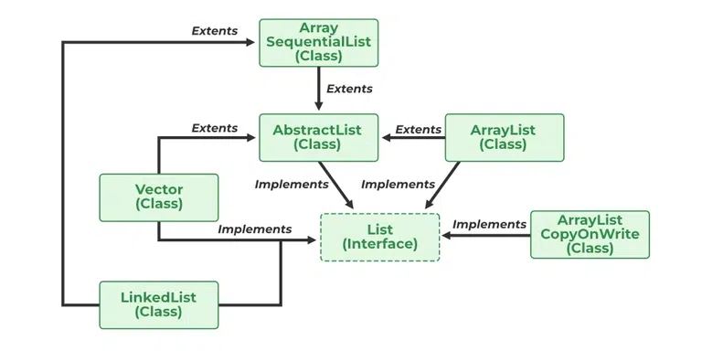

# 1.3.1 List

The List interface in Java provides a way to store the ordered collection. It is a child interface of Collection. It is
an ordered collection of objects in which duplicate values can be stored. Since List preserves the insertion order, it
allows positional access and insertion of elements.


<!-- TOC -->
* [1.3.1 List](#131-list)
  * [List Interface in Java](#list-interface-in-java)
  * [Declaration of Java List Interface](#declaration-of-java-list-interface)
  * [Example of Java List](#example-of-java-list)
  * [Operations in a Java List Interface](#operations-in-a-java-list-interface)
    * [1. Adding elements to List class using add() method](#1-adding-elements-to-list-class-using-add-method)
    * [2. Updating elements](#2-updating-elements)
    * [3. Searching for elements](#3-searching-for-elements)
    * [4. Removing Elements](#4-removing-elements)
    * [5. Accessing Elements](#5-accessing-elements)
    * [6. Checking if an element is present in the List](#6-checking-if-an-element-is-present-in-the-list)
  * [Complexity of List Interface in Java](#complexity-of-list-interface-in-java)
    * [1) Adding Element in List Interface](#1-adding-element-in-list-interface)
    * [2) Remove Element from List Interface](#2-remove-element-from-list-interface)
    * [3) Replace Element in List Interface](#3-replace-element-in-list-interface)
    * [4) Traversing List Interface](#4-traversing-list-interface)
  * [Java List vs Set](#java-list-vs-set)
  * [Classes Association with a Java List Interface](#classes-association-with-a-java-list-interface)
* [1.3.1.1 ArrayList](#1311-arraylist)
    * [Important Features of ArrayList in Java](#important-features-of-arraylist-in-java)
    * [Constructors in ArrayList in Java](#constructors-in-arraylist-in-java)
    * [Some Key Points of ArrayList in Java](#some-key-points-of-arraylist-in-java)
    * [Operations performed in ArrayList](#operations-performed-in-arraylist)
      * [1. Adding Elements](#1-adding-elements)
      * [2. Changing Elements](#2-changing-elements)
      * [3. Removing Elements](#3-removing-elements)
      * [4. Iterating the ArrayList](#4-iterating-the-arraylist)
      * [5. ArrayList Sort](#5-arraylist-sort)
  * [Advantages of Java ArrayList](#advantages-of-java-arraylist)
  * [Disadvantages of Java ArrayList](#disadvantages-of-java-arraylist)
<!-- TOC -->

## List Interface in Java

The List interface is found in java.util package and inherits the Collection interface. It is a factory of the
ListIterator interface. Through the ListIterator, we can iterate the list in forward and backward directions. The
implementation classes of the List interface are ArrayList, LinkedList, Stack, and Vector. ArrayList and LinkedList are
widely used in Java programming. The Vector class is deprecated since Java 5.

## Declaration of Java List Interface

```
public interface List<E> extends Collection<E> ; 
```

Let us elaborate on creating objects or instances in a List class. Since List is an interface, objects cannot be created
of the type list. We always need a class that implements this List in order to create an object. And also, after the
introduction of Generics in Java 1.5, it is possible to restrict the type of object that can be stored in the List. Just
like several other user-defined ‘interfaces’ implemented by user-defined ‘classes’, List is an ‘interface’, implemented
by the ArrayList class, pre-defined in java.util package.

**Syntax of Java List:**

This type of safelist can be defined as:

```
List<Obj> list = new ArrayList<Obj> ();
```

> Note: Obj is the type of the object to be stored in List

## Example of Java List

```java
class GFG {

    // Main driver method
    public static void main(String[] args) {

        // Creating an object of List interface
        // implemented by the ArrayList class
        List<Integer> l1 = new ArrayList<Integer>();

        // Adding elements to object of List interface
        // Custom inputs

        l1.add(0, 1);
        l1.add(1, 2);

        // Print the elements inside the object
        System.out.println(l1);

        // Now creating another object of the List
        // interface implemented ArrayList class
        // Declaring object of integer type
        List<Integer> l2 = new ArrayList<Integer>();

        // Again adding elements to object of List interface
        // Custom inputs
        l2.add(1);
        l2.add(2);
        l2.add(3);

        // Will add list l2 from 1 index
        l1.addAll(1, l2);

        System.out.println(l1);

        // Removes element from index 1
        l1.remove(1);

        // Printing the updated List 1
        System.out.println(l1);

        // Prints element at index 3 in list 1
        // using get() method
        System.out.println(l1.get(3));

        // Replace 0th element with 5
        // in List 1
        l1.set(0, 5);

        // Again printing the updated List 1
        System.out.println(l1);
    }
}
```

**Output:**

```
[1, 2]
[1, 1, 2, 3, 2]
[1, 2, 3, 2]
2
[5, 2, 3, 2]
```

## Operations in a Java List Interface

Since List is an interface, it can be used only with a class that implements this interface. Now, let’s see how to
perform a few frequently used operations on the List.

* Operation 1: **Adding** elements to List class using add() method
* Operation 2: **Updating** elements in List class using set() method
* Operation 3: **Searching** for elements using indexOf(), lastIndexOf methods
* Operation 4: **Removing** elements using remove() method
* Operation 5: **Accessing** Elements in List class using get() method
* Operation 6: **Checking** if an element **is present** in the List class using contains() method

### 1. Adding elements to List class using add() method

In order to add an element to the list, we can use the add() method. This method is overloaded to perform multiple
operations based on different parameters.

Parameters:  It takes 2 parameters, namely:

* add(Object): This method is used to add an element at the end of the List.
* add(int index, Object): This method is used to add an element at a specific index in the List

**Example:**

```java
class AddListExample {

    // Main driver method
    public static void main(String args[]) {
        // Creating an object of List interface,
        // implemented by ArrayList class
        List<String> al = new ArrayList<>();

        // Adding elements to object of List interface
        // Custom elements
        al.add("Geeks");
        al.add("Geeks");
        al.add(1, "For");

        // Print all the elements inside the
        // List interface object
        System.out.println(al);
    }
}
```

**Output:**

```
[Geeks, For, Geeks]
```

### 2. Updating elements

After adding the elements, if we wish to change the element, it can be done using the set() method. Since List is
indexed, the element which we wish to change is referenced by the index of the element. Therefore, this method takes an
index and the updated element which needs to be inserted at that index.

```java
class GFG {
    public static void main(String args[]) {
        // Creating an object of List interface
        List<String> al = new ArrayList<>();

        // Adding elements to object of List class
        al.add("Geeks");
        al.add("Geeks");
        al.add(1, "Geeks");

        // Display theinitial elements in List
        System.out.println("Initial ArrayList " + al);

        // Setting (updating) element at 1st index
        // using set() method
        al.set(1, "For");

        // Print and display the updated List
        System.out.println("Updated ArrayList " + al);
    }
}
```

**Output:**

```
Initial ArrayList [Geeks, Geeks, Geeks]
Updated ArrayList [Geeks, For, Geeks]
```

### 3. Searching for elements

Searching for elements in the List interface is a common operation in Java programming. The List interface provides
several methods to search for elements, such as the indexOf(), lastIndexOf() methods.

The indexOf() method returns the index of the first occurrence of a specified element in the list, while the
lastIndexOf() method returns the index of the last occurrence of a specified element.

Parameters:

- **indexOf(element)**: Returns the index of the first occurrence of the specified element in the list, or -1 if the
  element is not found
- **lastIndexOf(element)**: Returns the index of the last occurrence of the specified element in the list, or -1 if the
  element is not found

```java
public class ListExample {
    public static void main(String[] args) {
        // create a list of integers
        List<Integer> numbers = new ArrayList<>();

        // add some integers to the list
        numbers.add(1);
        numbers.add(2);
        numbers.add(3);
        numbers.add(2);

        // use indexOf() to find the first occurrence of an
        // element in the list
        int index = numbers.indexOf(2);
        System.out.println(
                "The first occurrence of 2 is at index "
                        + index);

        // use lastIndexOf() to find the last occurrence of
        // an element in the list
        int lastIndex = numbers.lastIndexOf(2);
        System.out.println(
                "The last occurrence of 2 is at index "
                        + lastIndex);
    }
}
```

**Output:**

```
The first occurrence of 2 is at index 1
The last occurrence of 2 is at index 3
```

### 4. Removing Elements

In order to remove an element from a list, we can use the remove() method. This method is overloaded to perform multiple
operations based on different parameters. They are:

Parameters:

- **remove(Object)**: This method is used to simply remove an object from the List. If there are multiple such objects,
  then the first occurrence of the object is removed.
- **remove(int index)**: Since a List is indexed, this method takes an integer value which simply removes the element
  present at that specific index in the List. After removing the element, all the elements are moved to the left to fill
  the
  space and the indices of the objects are updated.

```java
class GFG {
    public static void main(String args[]) {

        // Creating List class object
        List<String> al = new ArrayList<>();

        // Adding elements to the object
        // Custom inputs
        al.add("Geeks");
        al.add("Geeks");

        // Adding For at 1st indexes
        al.add(1, "For");

        // Print the initialArrayList
        System.out.println("Initial ArrayList " + al);

        // Now remove element from the above list
        // present at 1st index
        al.remove(1);

        // Print the List after removal of element
        System.out.println("After the Index Removal " + al);

        // Now remove the current object from the updated
        // List
        al.remove("Geeks");

        // Finally print the updated List now
        System.out.println("After the Object Removal "
                + al);
    }
}
```

**Output:**

```
Initial ArrayList [Geeks, For, Geeks]
After the Index Removal [Geeks, Geeks]
After the Object Removal [Geeks]
```

### 5. Accessing Elements

In order to access an element in the list, we can use the get() method, which returns the element at the specified index

**Parameters**:

- **get**(int index): This method returns the element at the specified index in the list.

```java
class GFG {
    public static void main(String args[]) {
        // Creating an object of List interface,
        // implemented by ArrayList class
        List<String> al = new ArrayList<>();

        // Adding elements to object of List interface
        al.add("Geeks");
        al.add("For");
        al.add("Geeks");

        // Accessing elements using get() method
        String first = al.get(0);
        String second = al.get(1);
        String third = al.get(2);

        // Printing all the elements inside the
        // List interface object
        System.out.println(first);
        System.out.println(second);
        System.out.println(third);
        System.out.println(al);
    }
}
```

**Output:**

```
Geeks
For
Geeks
[Geeks, For, Geeks]
```

### 6. Checking if an element is present in the List

In order to check if an element is present in the list, we can use the contains() method. This method returns true if
the specified element is present in the list, otherwise, it returns false.

**Parameters**:

- **contains(Object)**: This method takes a single parameter, the object to be checked if it is present in the list.

```java
class GFG {
    public static void main(String args[]) {
        // Creating an object of List interface,
        // implemented by ArrayList class
        List<String> al = new ArrayList<>();

        // Adding elements to object of List interface
        al.add("Geeks");
        al.add("For");
        al.add("Geeks");

        // Checking if element is present using contains()
        // method
        boolean isPresent = al.contains("Geeks");

        // Printing the result
        System.out.println("Is Geeks present in the list? "
                + isPresent);
    }
}
```

**Output:**

```
Is Geeks present in the list? true
```

## Complexity of List Interface in Java

| Operation                          | Time Complexity | Space Complexity |
|------------------------------------|-----------------|------------------|
| Adding Element in List Interface   | O(1)            | O(1)             |
| Remove Element from List Interface | O(N)            | O(N)             |
| Replace Element in List Interface  | O(N)            | O(N)             |
| Traversing List Interface          | O(N)            | O(N)             |

### 1) Adding Element in List Interface

- **Time Complexity: O(1)**

  This suggests that adding an element is a constant-time operation. This is typically true for ArrayList when adding an
  element at the end of the list, assuming there is enough capacity in the underlying array. If the array needs to be
  resized, the time complexity becomes O(N) due to the need to copy elements to a new array.
  For LinkedList, adding an element at the end is also O(1) because it involves updating pointers.
- **Space Complexity: O(1)**

  Adding an element requires a constant amount of additional space, regardless of the size of the list.

### 2) Remove Element from List Interface

- **Time Complexity: O(N)**

  Removing an element can be O(N) because it may require shifting elements (in the case of ArrayList) or traversing the
  list to find the element (in the case of LinkedList).
  For ArrayList, if you remove an element from the middle, all subsequent elements need to be shifted.
  For LinkedList, you may need to traverse the list to find the element to remove, which can take O(N) time.
- **Space Complexity: O(N)**

  This seems unusual, as removing an element typically doesn't require additional space proportional to the size of the
  list. The space complexity should generally be O(1) since you're not using extra space to remove an element.

### 3) Replace Element in List Interface

- **Time Complexity: O(N)**

  Replacing an element involves finding the element first, which can take O(N) time if you need to search for it.
  However, if you have the index, replacing an element in an ArrayList is O(1), while in a LinkedList, it can still be
  O(N) due to traversal.

- **Space Complexity: O(N)**

  Similar to removal, replacing an element typically doesn't require additional space proportional to the size of the
  list. The space complexity should generally be O(1).

### 4) Traversing List Interface

- **Time Complexity: O(N)**

  Traversing a list involves visiting each element once, which takes linear time, O(N), where N is the number of
  elements in the list.
-
- **Space Complexity: O(N)**

  This is likely a misunderstanding. Traversing a list should have a space complexity of O(1) because you are not using
  additional space proportional to the size of the list. You typically use a single iterator or index variable.

## Java List vs Set

Both the List interface and the Set interface inherits the Collection interface. However, there exists some differences
between them.

| List                                                          | Set                                             |
|---------------------------------------------------------------|-------------------------------------------------|
| The List is an ordered sequence.                              | The Set is an unordered sequence.               |
| List allows duplicate elements                                | Set doesn’t allow duplicate elements.           |
| Elements by their position can be accessed.                   | Position access to elements is not allowed.     |
| Multiple null elements can be stored.                         | The null element can store only once.           |
| List implementations are ArrayList, LinkedList, Vector, Stack | Set implementations are HashSet, LinkedHashSet. |

## Classes Association with a Java List Interface



AbstractList, CopyOnWriteArrayList, and the AbstractSequentialList are the classes that implement the List interface. A
separate functionality is implemented in each of the mentioned classes. They are as follows:

1. **AbstractList**: This class is used to implement an unmodifiable list, for which one needs to only extend this
   AbstractList Class and implement only the _get_() and the _size_() methods.
2. **CopyOnWriteArrayList**: This class implements the list interface. It is an enhanced version of ArrayList in which
   all the modifications(add, set, remove, etc.) are implemented by making a fresh copy of the list.
3. **AbstractSequentialList**: This class implements the Collection interface and the AbstractCollection class. This
   class is used to implement an unmodifiable list, for which one needs to only extend this AbstractList Class and
   implement only the _get_() and the _size_() methods.

# 1.3.1.1 ArrayList

Java ArrayList is a part of the Java collections framework and it is a class of java.util package. It provides us with
dynamic arrays in Java. Though, it may be slower than standard arrays but can be helpful in programs where lots of
manipulation in the array is needed. This class is found in java.util package. The main advantage of ArrayList in Java
is, that if we declare an array then we need to mention the size, but in ArrayList, it is not needed to mention the size
of ArrayList. If you want to mention the size then you can do it.

**What is ArrayList in Java?**

ArrayList is a Java class implemented using the List interface. Java ArrayList, as the name suggests, provides the
functionality of a dynamic array where the size is not fixed as an array. Also, as a part of the Collections framework,
it has many features not available with arrays.

**Java ArrayList Example**

```java
class ArrayListExample {
    public static void main(String[] args) {
        // Size of the
        // ArrayList
        int n = 5;

        // Declaring the ArrayList with
        // initial size n
        ArrayList<Integer> arr1 = new ArrayList<Integer>(n);

        // Declaring the ArrayList
        ArrayList<Integer> arr2 = new ArrayList<Integer>();

        // Printing the ArrayList
        System.out.println("Array 1:" + arr1);
        System.out.println("Array 2:" + arr2);

        // Appending new elements at
        // the end of the list
        for (int i = 1; i <= n; i++) {
            arr1.add(i);
            arr2.add(i);
        }

        // Printing the ArrayList
        System.out.println("Array 1:" + arr1);
        System.out.println("Array 2:" + arr2);
    }
}
```

**Output:**

```
Array 1:[]
Array 2:[]
Array 1:[1, 2, 3, 4, 5]
Array 2:[1, 2, 3, 4, 5]
```

**What is the difference of
ArrayList<Integer> arr1 = new ArrayList<Integer>();
List<Integer> arr2 = new ArrayList<Integer>();**

1) **ArrayList<Integer> arr1 = new ArrayList<Integer>();**

    - Type of Reference: ArrayList<Integer>
    - Object Type: ArrayList<Integer>

   In this declaration, both the reference type and the object type are ArrayList<Integer>. This means that arr1 can
   access all the methods specific to the ArrayList class, in addition to those defined in the List interface.


2) **List<Integer> arr2 = new ArrayList<Integer>();**
    - Type of Reference: List<Integer>
    - Object Type: ArrayList<Integer>

   In this declaration, the reference type is List<Integer>, which is an interface, while the object type is
   ArrayList<Integer>. This is an example of programming to an interface, which is a common practice in Java. By using a
   List reference, you can take advantage of polymorphism, allowing you to easily switch to a different List
   implementation (like LinkedList) without changing the code that uses arr2.

**Key Differences**

**Flexibility:**

- Using List<Integer> as the reference type (arr2) provides more flexibility. You can change the implementation to
  another class that implements the List interface (e.g., LinkedList, Vector) without modifying the rest of your code.

**Access to Methods:**

- With ArrayList<Integer> as the reference type (arr1), you can access methods specific to ArrayList that are not part
  of the List interface. For example, ArrayList has methods like trimToSize() and ensureCapacity(int minCapacity) that
  are not available through a List reference.

**Polymorphism:**

- Using a List reference (arr2) allows you to take advantage of polymorphism, which is a key principle in
  object-oriented programming. It enables you to write more generic and reusable code.

In summary, using List<Integer> as the reference type is generally preferred when you want to write flexible and
maintainable code that can easily adapt to different list implementations. However, if you need to use specific features
of ArrayList, you might choose to use ArrayList<Integer> as the reference type.

### Important Features of ArrayList in Java

* ArrayList inherits AbstractList class and implements the List interface.
* ArrayList is initialized by size. However, the size is increased automatically if the collection grows or shrinks if
  the objects are removed from the collection.
* Java ArrayList allows us to randomly access the list.
* ArrayList can not be used for primitive types, like int, char, etc. We need a wrapper class for such cases.
* ArrayList in Java can be seen as a vector in C++.
* ArrayList is not Synchronized. Its equivalent synchronized class in Java is Vector.

### Constructors in ArrayList in Java

In order to Create an ArrayList, we need to create an object of the ArrayList class. The ArrayList class consists of
various constructors which allow the possible creation of the array list. The following are the constructors available
in this class:

1. **ArrayList()**

   This constructor is used to build an empty array list. If we wish to create an empty ArrayList with the name arr,
   then, it can be created as:

   ```ArrayList arr = new ArrayList();```

2. **ArrayList(Collection c)**

   This constructor is used to build an array list initialized with the elements from the collection c. Suppose, we wish
   to create an ArrayList arr which contains the elements present in the collection c, then, it can be created as:

   ```ArrayList arr = new ArrayList(c);```

3. **ArrayList(int capacity)**

   This constructor is used to build an array list with the initial capacity being specified. Suppose we wish to create
   an ArrayList with the initial size being N, then, it can be created as:

   ```ArrayList arr = new ArrayList(N);```

### Some Key Points of ArrayList in Java

1. ArrayList is Underlined data Structure Resizable Array or Growable Array.
2. ArrayList Duplicates Are Allowed.
3. Insertion Order is Preserved.
4. Heterogeneous objects are allowed.
5. Null insertion is possible.

### Operations performed in ArrayList

#### 1. Adding Elements

In order to add an element to an ArrayList, we can use the add() method. This method is overloaded to perform multiple
operations based on different parameters. They are as follows:

- add(Object): This method is used to add an element at the end of the ArrayList.
- add(int index, Object): This method is used to add an element at a specific index in the ArrayList.

```java
class GFG {
    public static void main(String args[]) {
        // Creating an Array of string type
        ArrayList<String> al = new ArrayList<>();

        // Adding elements to ArrayList
        // Custom inputs
        al.add("Geeks");
        al.add("Geeks");

        // Here we are mentioning the index
        // at which it is to be added
        al.add(1, "For");

        // Printing all the elements in an ArrayList
        System.out.println(al);
    }
}
```

**Output:**

```
[Geeks, For, Geeks]
```

#### 2. Changing Elements

After adding the elements, if we wish to change the element, it can be done using the set() method. Since an ArrayList
is indexed, the element which we wish to change is referenced by the index of the element. Therefore, this method takes
an index and the updated element which needs to be inserted at that index.

```java
class GFG {
    public static void main(String args[]) {
        // Creating an Arraylist object of string type
        ArrayList<String> al = new ArrayList<>();

        // Adding elements to Arraylist
        // Custom input elements
        al.add("Geeks");
        al.add("Geeks");

        // Adding specifying the index to be added
        al.add(1, "Geeks");

        // Printing the Arraylist elements
        System.out.println("Initial ArrayList " + al);

        // Setting element at 1st index
        al.set(1, "For");

        //  Printing the updated Arraylist
        System.out.println("Updated ArrayList " + al);
    }
}
```

**Output:**

```
Initial ArrayList [Geeks, Geeks, Geeks]
Updated ArrayList [Geeks, For, Geeks]
```

#### 3. Removing Elements

In order to remove an element from an ArrayList, we can use the remove() method. This method is overloaded to perform
multiple operations based on different parameters. They are as follows:

- **remove(Object)**: This method is used to simply remove an object from the ArrayList. If there are multiple such
  objects, then the first occurrence of the object is removed.
- **remove(int index)**: Since an ArrayList is indexed, this method takes an integer value which simply removes the
  element present at that specific index in the ArrayList. After removing the element, all the elements are moved to the
  left to fill the space and the indices of the objects are updated.

```java
class GFG {
    public static void main(String args[]) {
        // Creating an object of arraylist class
        ArrayList<String> al = new ArrayList<>();

        // Adding elements to ArrayList
        // Custom addition
        al.add("Geeks");
        al.add("Geeks");
        // Adding element at specific index
        al.add(1, "For");

        // Printing all elements of ArrayList
        System.out.println("Initial ArrayList " + al);

        // Removing element from above ArrayList
        al.remove(1);

        // Printing the updated Arraylist elements
        System.out.println("After the Index Removal " + al);

        // Removing this word element in ArrayList
        al.remove("Geeks");

        // Now printing updated ArrayList
        System.out.println("After the Object Removal "
                + al);
    }
}
```

**Output:**

```
Initial ArrayList [Geeks, For, Geeks]
After the Index Removal [Geeks, Geeks]
After the Object Removal [Geeks]
```

#### 4. Iterating the ArrayList

There are multiple ways to iterate through the ArrayList. The most famous ways are by using the basic for loop in
combination with a get() method to get the element at a specific index and the advanced for a loop.

```java
class GFG {
    public static void main(String args[]) {
        // Creating an Arraylist of string type
        ArrayList<String> al = new ArrayList<>();

        // Adding elements to ArrayList
        //  using standard add() method
        al.add("Geeks");
        al.add("Geeks");
        al.add(1, "For");

        // Using the Get method and the
        // for loop
        for (int i = 0; i < al.size(); i++) {

            System.out.print(al.get(i) + " ");
        }

        System.out.println();

        // Using the for each loop
        for (String str : al)
            System.out.print(str + " ");
    }
}
```

**Output:**

```
Geeks For Geeks 
Geeks For Geeks 
```

#### 5. ArrayList Sort

```java
class GFG {
    public static void main(String[] args) {
        ArrayList<Integer> list = new ArrayList();
        list.add(2);
        list.add(4);
        list.add(3);
        list.add(1);
        System.out.println("Before sorting list:");
        System.out.println(list);
        Collections.sort(list);
        System.out.println("after sorting list:");
        System.out.println(list);
    }
}
```

**Output:**

```
Before sorting list:
[2, 4, 3, 1]
after sorting list:
[1, 2, 3, 4]
```

## Advantages of Java ArrayList

* **Dynamic size**: ArrayList can dynamically grow and shrink in size, making it easy to add or remove elements as
  needed.
* **Easy to use**: ArrayList is simple to use, making it a popular choice for many Java developers.
* **Fast access**: ArrayList provides fast access to elements, as it is implemented as an array under the hood.
* **Ordered collection**: ArrayList preserves the order of elements, allowing you to access elements in the order they
  were added.
* **Supports null values**: ArrayList can store null values, making it useful in cases where the absence of a value
  needs to be represented.

## Disadvantages of Java ArrayList

* **Slower than arrays**: ArrayList is slower than arrays for certain operations, such as inserting elements in the
  middle of the list.
* **Increased memory usage**: ArrayList requires more memory than arrays, as it needs to maintain its dynamic size and
  handle resizing.
* **Not thread-safe**: ArrayList is not thread-safe, meaning that multiple threads may access and modify the list
  concurrently, leading to potential race conditions and data corruption.
* **Performance degradation**: ArrayList’s performance may degrade as the number of elements in the list increases,
  especially for operations such as searching for elements or inserting elements in the middle of the list.


