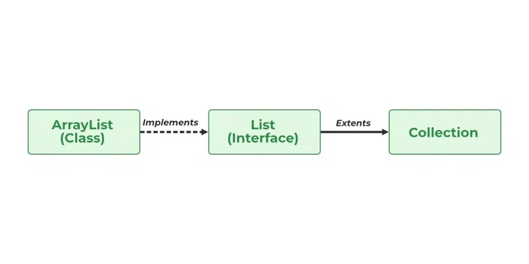

# 1.3.1 List

The List interface in Java provides a way to store the ordered collection. It is a child interface of Collection. It is
an ordered collection of objects in which duplicate values can be stored. Since List preserves the insertion order, it
allows positional access and insertion of elements.



<!-- TOC -->
* [1.3.1 List](#131-list)
  * [List Interface in Java](#list-interface-in-java)
  * [Declaration of Java List Interface](#declaration-of-java-list-interface)
  * [Example of Java List](#example-of-java-list)
  * [Operations in a Java List Interface](#operations-in-a-java-list-interface)
    * [1. Adding elements to List class using add() method](#1-adding-elements-to-list-class-using-add-method)
<!-- TOC -->

## List Interface in Java

The List interface is found in java.util package and inherits the Collection interface. It is a factory of the
ListIterator interface. Through the ListIterator, we can iterate the list in forward and backward directions. The
implementation classes of the List interface are ArrayList, LinkedList, Stack, and Vector. ArrayList and LinkedList are
widely used in Java programming. The Vector class is deprecated since Java 5.

## Declaration of Java List Interface

```
public interface List<E> extends Collection<E> ; 
```

Let us elaborate on creating objects or instances in a List class. Since List is an interface, objects cannot be created
of the type list. We always need a class that implements this List in order to create an object. And also, after the
introduction of Generics in Java 1.5, it is possible to restrict the type of object that can be stored in the List. Just
like several other user-defined ‘interfaces’ implemented by user-defined ‘classes’, List is an ‘interface’, implemented
by the ArrayList class, pre-defined in java.util package.

**Syntax of Java List:**

This type of safelist can be defined as:

```
List<Obj> list = new ArrayList<Obj> ();
```

> Note: Obj is the type of the object to be stored in List

## Example of Java List

```java
class GFG {

    // Main driver method
    public static void main(String[] args) {

        // Creating an object of List interface
        // implemented by the ArrayList class
        List<Integer> l1 = new ArrayList<Integer>();

        // Adding elements to object of List interface
        // Custom inputs

        l1.add(0, 1);
        l1.add(1, 2);

        // Print the elements inside the object
        System.out.println(l1);

        // Now creating another object of the List
        // interface implemented ArrayList class
        // Declaring object of integer type
        List<Integer> l2 = new ArrayList<Integer>();

        // Again adding elements to object of List interface
        // Custom inputs
        l2.add(1);
        l2.add(2);
        l2.add(3);

        // Will add list l2 from 1 index
        l1.addAll(1, l2);

        System.out.println(l1);

        // Removes element from index 1
        l1.remove(1);

        // Printing the updated List 1
        System.out.println(l1);

        // Prints element at index 3 in list 1
        // using get() method
        System.out.println(l1.get(3));

        // Replace 0th element with 5
        // in List 1
        l1.set(0, 5);

        // Again printing the updated List 1
        System.out.println(l1);
    }
}
```

**Output:**

```
[1, 2]
[1, 1, 2, 3, 2]
[1, 2, 3, 2]
2
[5, 2, 3, 2]
```

## Operations in a Java List Interface

Since List is an interface, it can be used only with a class that implements this interface. Now, let’s see how to
perform a few frequently used operations on the List.

* Operation 1: **Adding** elements to List class using add() method
* Operation 2: **Updating** elements in List class using set() method
* Operation 3: **Searching** for elements using indexOf(), lastIndexOf methods
* Operation 4: **Removing** elements using remove() method
* Operation 5: **Accessing** Elements in List class using get() method
* Operation 6: **Checking** if an element **is present** in the List class using contains() method

### 1. Adding elements to List class using add() method

In order to add an element to the list, we can use the add() method. This method is overloaded to perform multiple
operations based on different parameters.

Parameters:  It takes 2 parameters, namely:

* add(Object): This method is used to add an element at the end of the List.
* add(int index, Object): This method is used to add an element at a specific index in the List

**Example:**

```java
class AddListExample {

    // Main driver method
    public static void main(String args[]) {
        // Creating an object of List interface,
        // implemented by ArrayList class
        List<String> al = new ArrayList<>();

        // Adding elements to object of List interface
        // Custom elements
        al.add("Geeks");
        al.add("Geeks");
        al.add(1, "For");

        // Print all the elements inside the
        // List interface object
        System.out.println(al);
    }
}
```

**Output:**

```
[Geeks, For, Geeks]
```