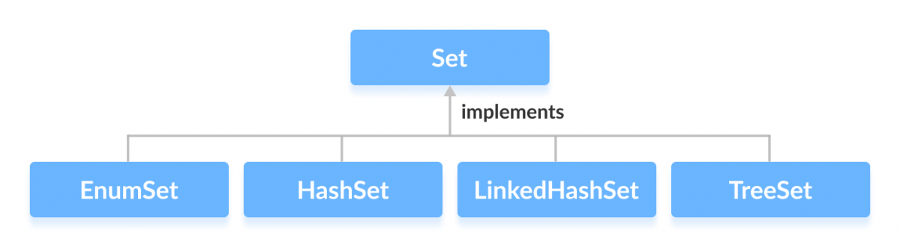

# 1.3.2 Set

Java Set is a collection of elements (Or objects) that contains no duplicate elements. Java Set is an interface that
extends Collection interface. Unlike List, Java Set is NOT an ordered collection, it’s elements does NOT have a
particular order. Java Set does NOT provide a control over the position where you can insert an element. You cannot
access elements by their index and also search elements in the list.



<!-- TOC -->
* [1.3.2 Set](#132-set)
  * [Key Characteristics of a Set](#key-characteristics-of-a-set)
  * [Syntax](#syntax)
    * [Common Implementations](#common-implementations)
<!-- TOC -->

## Key Characteristics of a Set

- **Unique Elements**: A Set ensures that no duplicate elements are present.
- **Null Elements**: Most implementations allow a single null element.
- **Unordered vs. Ordered vs. Sorted**:
    - **HashSet** is unordered.
    - **LinkedHashSet** maintains insertion order.
    - **TreeSet** maintains a sorted order.

## Syntax

Declaring a Set

```java
Set<Type> setName = new HashSet<>();
```

### Common Implementations
**HashSet:**

```java
Set<String> hashSet = new HashSet<>();
```

**LinkedHashSet:**

```java
Set<String> linkedHashSet = new LinkedHashSet<>();
```

**TreeSet:**

```java
Set<String> treeSet = new TreeSet<>();
```