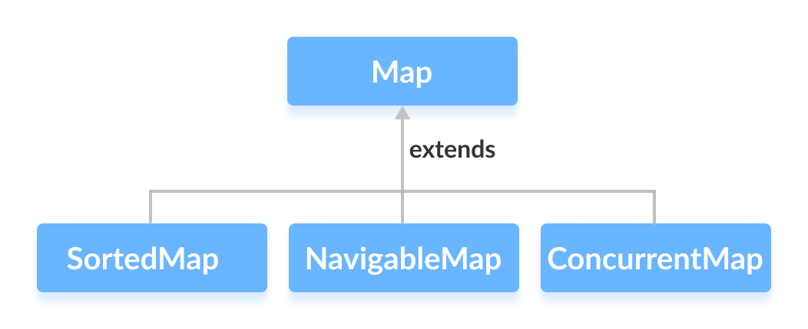

# 1.3.3 Map

The Map interface in Java is part of the java.util package and represents a collection of key-value pairs. Unlike other
collection interfaces, Map is not a subtype of Collection. It is designed for situations where you need to associate
keys with values, allowing efficient retrieval of values based on their keys.

<!-- TOC -->
* [1.3.3 Map](#133-map)
  * [Key Characteristics](#key-characteristics)
  * [Characteristics of a Map Interface](#characteristics-of-a-map-interface)
  * [How It Works](#how-it-works)
  * [Constructors](#constructors)
  * [Common Operations](#common-operations)
  * [Best Practices](#best-practices)
  * [FAQs and Interview Questions](#faqs-and-interview-questions)
* [1.3.3.1 HashMap](#1331-hashmap)
  * [Key Characteristics](#key-characteristics-1)
  * [How It Works](#how-it-works-1)
  * [Constructors](#constructors-1)
  * [Common Operations](#common-operations-1)
  * [Best Practices](#best-practices-1)
  * [FAQs and Interview Questions](#faqs-and-interview-questions-1)
* [1.3.3.2 TreeMap](#1332-treemap)
  * [Key Characteristics](#key-characteristics-2)
  * [How It Works](#how-it-works-2)
  * [Constructors](#constructors-2)
  * [Common Operations](#common-operations-2)
  * [Best Practices](#best-practices-2)
  * [FAQs and Interview Questions](#faqs-and-interview-questions-2)
* [1.3.3.3 LinkedHashMap](#1333-linkedhashmap)
  * [Key Characteristics](#key-characteristics-3)
  * [How It Works](#how-it-works-3)
  * [Constructors](#constructors-3)
  * [Common Operations](#common-operations-3)
  * [Best Practices](#best-practices-3)
  * [FAQs and Interview Questions](#faqs-and-interview-questions-3)
<!-- TOC -->

The Map interface is also extended by these sub-interfaces:

* SortedMap
* NavigableMap
* ConcurrentMap



## Key Characteristics

- **Key-Value Pairs**: Each element in a Map is a key-value pair. Keys must be unique, but values can be duplicated.

- **No Direct Collection Methods**: Map does not extend Collection, so it lacks direct support for bulk operations like
  addAll or removeAll.

- **Null Values**: Depending on the implementation, Map can allow one null key and multiple null values (e.g., HashMap),
  while others (e.g., Hashtable) do not permit null keys or values.

- **Various Implementations**: Map has several implementations, including HashMap, LinkedHashMap, TreeMap, and
  Hashtable, each with different characteristics regarding ordering, null handling, and performance.

## Characteristics of a Map Interface

- A Map cannot contain duplicate keys and each key can map to at most one value. Some implementations allow null key and
  null values like the HashMap and LinkedHashMap, but some do not like the TreeMap.
- The order of a map depends on the specific implementations. For example, TreeMap and LinkedHashMap have predictable
  orders, while HashMap does not.
- There are two interfaces for implementing Map in Java. They are Map and SortedMap, and three classes: **HashMap,
  TreeMap, and LinkedHashMap**.

## How It Works

- **Key-Based Access**: Map provides efficient access to values based on their associated keys. This is typically
  achieved through hash tables or tree structures.

- **Hashing and Balancing**: Implementations like HashMap use hash tables, while TreeMap uses a Red-Black tree to
  maintain sorted order.

## Constructors

Each Map implementation provides its own constructors, but common ones include:

- **Default Constructor: Initializes an empty map.**

```java
Map<KeyType, ValueType> map = new HashMap<>();
```

- **With Initial Capacity: Specifies an initial capacity and load factor for hash-based maps.**

```java
Map<KeyType, ValueType> map = new HashMap<>(
int initialCapacity, float loadFactor);
```

- **From Another Map**: Initializes a map with the entries from another map.

```java
Map<KeyType, ValueType> map = new HashMap<>(existingMap);
```

## Common Operations

```java
import java.util.HashMap;
import java.util.Map;

public class MapExample {
    public static void main(String[] args) {
        Map<String, Integer> map = new HashMap<>();

        // Adding key-value pairs
        map.put("Alice", 30);
        map.put("Bob", 25);
        map.put("Charlie", 35);

        // Accessing a value by key
        Integer ageBob = map.get("Bob");
        System.out.println("Bob's age: " + ageBob);

        // Checking for a key or value
        boolean hasAlice = map.containsKey("Alice");
        boolean hasAge40 = map.containsValue(40);
        System.out.println("Contains key 'Alice': " + hasAlice);
        System.out.println("Contains value 40: " + hasAge40);

        // Removing a key-value pair
        map.remove("Charlie");

        // Iterating over keys, values, and entries
        System.out.println("Keys: " + map.keySet());
        System.out.println("Values: " + map.values());
        System.out.println("Entries: " + map.entrySet());
    }
}
```

## Best Practices

- **Choose the Right Implementation**: Use HashMap for general-purpose use, LinkedHashMap for maintaining insertion
  order, TreeMap for sorted order, and Hashtable for synchronized access (though ConcurrentHashMap is often preferred).

- **Minimize Collisions**: When using hash-based maps, ensure that the hashCode() method is properly implemented to
  minimize collisions.

- **Avoid Nulls in Some Implementations**: Be cautious with null keys and values, as not all implementations support
  them.

- **Use Appropriate Capacity**: For hash-based maps, set an appropriate initial capacity and load factor to optimize
  performance.

## FAQs and Interview Questions

1. **What is a Map in Java, and how is it different from a Collection?**

Answer: A Map represents a collection of key-value pairs and is not a subtype of Collection. Unlike collections, a Map
is used for key-based access and does not support operations like iteration over elements without converting to a
collection view.

2. **How do HashMap and Hashtable differ?**

Answer: HashMap is unsynchronized and allows null keys and values, while Hashtable is synchronized and does not allow
null keys or values.

3. **What are the main differences between HashMap and TreeMap?**

Answer: HashMap provides constant-time performance for basic operations and stores elements in an arbitrary order, while
TreeMap stores elements in a sorted order based on natural ordering or a custom comparator, with log(n) time complexity
for operations.

4. **How can you ensure thread safety when using a Map?**

Answer: Use a ConcurrentHashMap for thread-safe operations without locking the entire map, or use
Collections.synchronizedMap() to wrap a map with synchronized access.

5. **Why should you override equals() and hashCode() when using a custom key type in a Map?**

Answer: Overriding equals() and hashCode() ensures that keys are compared correctly for equality and are distributed
properly in hash-based maps, preventing issues like duplicate keys or poor performance.

--- 

# 1.3.3.1 HashMap

HashMap is a part of the Java Collections Framework and provides a basic implementation of the Map interface. It is used
to store data in the form of key-value pairs, where each key is unique and maps to a specific value.

## Key Characteristics

- **Key-Value Storage**: Stores elements as key-value pairs, allowing efficient retrieval of values by their keys.

- **Hash Table Based**: Internally uses a hash table to store entries, achieving average time complexity of O(1) for
  operations like put, get, and remove.

- **Unordered**: Does not guarantee any specific order of elements. The iteration order is not constant over time.

- **Allows Nulls**: Permits one null key and multiple null values.

- **Not Synchronized**: HashMap is unsynchronized and not thread-safe. If concurrent access is required, consider using
  ConcurrentHashMap.

## How It Works

- **Hashing**: Uses the hashCode() of keys to compute an index in an internal array where the key-value pair is stored.

- **Buckets and Collisions**: Keys with the same hash code are stored in a bucket. In case of collisions (multiple keys
  mapping to the same index), they are stored in a linked list or a balanced tree (since Java 8) within that bucket.

## Constructors

**Default Constructor:**

```java
HashMap<KeyType, ValueType> map = new HashMap<>();
```

**With Initial Capacity:**

```java
HashMap<KeyType, ValueType> map = new HashMap<>(
int initialCapacity);
```

**With Initial Capacity and Load Factor:**

```java
HashMap<KeyType, ValueType> map = new HashMap<>(
int initialCapacity, float loadFactor);
```

**From Another Map:**

```java
HashMap<KeyType, ValueType> map = new HashMap<>(Map < ? extends KeyType,?extends ValueType>anotherMap);
```

## Common Operations

```java
import java.util.HashMap;
import java.util.Map;

public class HashMapExample {
    public static void main(String[] args) {
        Map<String, Integer> map = new HashMap<>();

        // Adding key-value pairs
        map.put("Alice", 30);
        map.put("Bob", 25);
        map.put("Charlie", 35);

        // Accessing a value by key
        Integer ageBob = map.get("Bob");
        System.out.println("Bob's age: " + ageBob);

        // Checking for a key or value
        boolean hasAlice = map.containsKey("Alice");
        boolean hasAge40 = map.containsValue(40);
        System.out.println("Contains key 'Alice': " + hasAlice);
        System.out.println("Contains value 40: " + hasAge40);

        // Removing a key-value pair
        map.remove("Charlie");

        // Iterating over keys, values, and entries
        System.out.println("Keys: " + map.keySet());
        System.out.println("Values: " + map.values());
        System.out.println("Entries: " + map.entrySet());
    }
}
```

## Best Practices

- **Choose Appropriate Initial Capacity**: Set an initial capacity that can accommodate expected entries to minimize
  resizing.

- **Understand Load Factor**: The default load factor is 0.75, balancing time and space cost. Adjust it if needed to
  reduce collisions or memory usage.

- **Implement hashCode() and equals()**: For custom key types, properly implement these methods to ensure correct
  behavior and performance.

- **Consider ConcurrentHashMap for Thread Safety**: Use ConcurrentHashMap if the map will be accessed by multiple
  threads concurrently.

## FAQs and Interview Questions

1. **What is a HashMap in Java, and how does it differ from Hashtable?**

   Answer: HashMap is an unsynchronized map that allows null keys and values, whereas Hashtable is synchronized and does
   not allow nulls.

2. **How does a HashMap handle collisions?**

   Answer: It uses a linked list to store entries with the same hash code in a bucket, which turns into a balanced tree
   if the bucket size exceeds a threshold (since Java 8).

3. **What happens when the capacity of a HashMap is exceeded?**

   Answer: The HashMap will automatically resize by doubling the capacity and rehashing the existing entries, which can
   be
   a costly operation.

4. **Why is it important to override hashCode() and equals() for custom key types?**

   Answer: Proper implementation ensures that keys are compared correctly for equality and are distributed effectively
   across the hash table, minimizing collisions.

5. **How can you make a HashMap thread-safe?**

   Answer: Use Collections.synchronizedMap() to wrap the HashMap or use ConcurrentHashMap for better performance in
   concurrent scenarios.

--- 

# 1.3.3.2 TreeMap

TreeMap is a part of the Java Collections Framework and implements the Map interface and NavigableMap along with the
AbstractMap class. It stores key-value pairs in a sorted order based on the keys, providing an efficient way to manage
sorted data.

## Key Characteristics

- **Sorted Order**: TreeMap stores entries in a sorted order based on the natural ordering of keys or a comparator
  provided at the time of map creation.

- **NavigableMap**: Implements the NavigableMap interface, providing navigation methods such as lowerKey(), floorKey(),
  ceilingKey(), and higherKey().

- **Red-Black Tree**: Internally uses a Red-Black tree, a self-balancing binary search tree, ensuring log(n) time
  complexity for basic operations like add, remove, and lookup.

- **Not Synchronized**: TreeMap is not synchronized. If it will be accessed by multiple threads concurrently, it must be
  synchronized externally.

- **Nulls**: Does not allow null keys, but can store multiple null values.

## How It Works

- **Tree Structure**: Uses a Red-Black tree to maintain entries in sorted order. This structure allows for efficient
  insertion, deletion, and lookup operations.

- **Ordering**: Can order keys according to their natural order (if they implement Comparable) or according to a custom
  Comparator provided at map creation.

## Constructors

**Default Constructor:**

```java
TreeMap<KeyType, ValueType> map = new TreeMap<>();
```

**With Comparator:**

```java
TreeMap<KeyType, ValueType> map = new TreeMap<>(Comparator < KeyType > comparator);
```

**From Another Map:**

```java
TreeMap<KeyType, ValueType> map = new TreeMap<>(Map < ? extends KeyType,?extends ValueType>anotherMap);
```

**From Another SortedMap:**

```java
TreeMap<KeyType, ValueType> map = new TreeMap<>(SortedMap < KeyType, ? extends ValueType>anotherSortedMap);
```

## Common Operations

```java
import java.util.TreeMap;
import java.util.Map;

public class TreeMapExample {
    public static void main(String[] args) {
        Map<String, Integer> treeMap = new TreeMap<>();

        // Adding key-value pairs
        treeMap.put("Alice", 30);
        treeMap.put("Bob", 25);
        treeMap.put("Charlie", 35);

        // Accessing a value by key
        Integer ageBob = treeMap.get("Bob");
        System.out.println("Bob's age: " + ageBob);

        // Checking for a key or value
        boolean hasAlice = treeMap.containsKey("Alice");
        boolean hasAge40 = treeMap.containsValue(40);
        System.out.println("Contains key 'Alice': " + hasAlice);
        System.out.println("Contains value 40: " + hasAge40);

        // Removing a key-value pair
        treeMap.remove("Charlie");

        // Iterating over keys, values, and entries
        System.out.println("Keys: " + treeMap.keySet());
        System.out.println("Values: " + treeMap.values());
        System.out.println("Entries: " + treeMap.entrySet());

        // NavigableMap features
        String firstKey = ((TreeMap<String, Integer>) treeMap).firstKey();
        String lastKey = ((TreeMap<String, Integer>) treeMap).lastKey();
        System.out.println("First key: " + firstKey);
        System.out.println("Last key: " + lastKey);
    }
}
```

## Best Practices

- **Use for Sorted Data**: Prefer TreeMap when you need to store entries in a sorted order and perform range searches or
  order-sensitive operations.

- **Comparator Usage**: Use a custom comparator if you need a specific order other than the natural ordering of keys.

- **Avoid Null Keys**: TreeMap does not allow null keys, so ensure that keys are always non-null.

- **Synchronization**: If multiple threads will access the TreeMap concurrently, consider wrapping it with
  Collections.synchronizedMap() or using another synchronization mechanism.

## FAQs and Interview Questions

1. **What is a TreeMap in Java, and how does it differ from a HashMap?**

   Answer: TreeMap stores entries in a sorted order based on keys, whereas HashMap stores entries in an arbitrary order.
   TreeMap uses a Red-Black tree, while HashMap uses a hash table.

2. **How does TreeMap maintain order?**

   Answer: TreeMap uses a Red-Black tree to maintain keys in a sorted order based on natural ordering or a custom
   comparator.

3. **Can TreeMap store null keys or values?**

   Answer: TreeMap does not allow null keys but can store multiple null values.

4. **What is the time complexity of basic operations in a TreeMap?**

   Answer: The time complexity for basic operations like add, remove, and lookup is O(log n) due to the Red-Black tree
   structure.

5. **How can you synchronize access to a TreeMap?**

   Answer: Use Collections.synchronizedMap() to create a synchronized map or externally synchronize access to the
   TreeMap if it will be accessed by multiple threads concurrently.

--- 

# 1.3.3.3 LinkedHashMap

LinkedHashMap is a part of the Java Collections Framework and extends HashMap. It retains all functionalities of a
HashMap but adds the capability to maintain a predictable iteration order, either based on insertion order or access
order.

## Key Characteristics

- **Order Maintenance:**

    - **Insertion Order:** By default, LinkedHashMap maintains elements in the order they were inserted.
    - **Access Order:** Can optionally maintain order based on the last access to elements if specified during
      construction.

- **Hash Table with Linked List:**

    - Combines a hash table with a doubly-linked list, providing efficient iteration order while maintaining the
      performance of a hash table for lookup.

- **Performance:**

    - Retains the O(1) time complexity for basic operations like add, remove, and lookup, similar to HashMap.

- **Nulls Allowed:**

    - Supports null keys and values, similar to HashMap.

- **Not Synchronized:**

    - **LinkedHashMap** is not synchronized. For concurrent access, it must be synchronized externally.

## How It Works

- **Doubly-Linked List:**

    - Each entry in the map is a node in a doubly-linked list, which maintains the iteration order.

- **Hashing:**

    - Utilizes hashing for quick access, insertion, and deletion, like HashMap.

## Constructors

1. **Default Constructor:**

```java
LinkedHashMap<KeyType, ValueType> map = new LinkedHashMap<>();
```

2. **With initial capacity and Load Factor:**

```java
LinkedHashMap<KeyType, ValueType> map = new LinkedHashMap<>(
int initialCapacity, float loadFactor);
```

3. **With initial capacity, Load Factor and Access Order:**

```java
LinkedHashMap<KeyType, ValueType> map = new LinkedHashMap<>(
int initialCapacity, float loadFactor, boolean accessOrder);
```

4. **From Another Map:**

```java
LinkedHashMap<KeyType, ValueType> map = new LinkedHashMap<>(Map < ? extends KeyType,?extends ValueType>anotherMap);
```

## Common Operations

```java
import java.util.LinkedHashMap;
import java.util.Map;

public class LinkedHashMapExample {
    public static void main(String[] args) {
        Map<String, Integer> linkedHashMap = new LinkedHashMap<>();

        // Adding key-value pairs
        linkedHashMap.put("Alice", 30);
        linkedHashMap.put("Bob", 25);
        linkedHashMap.put("Charlie", 35);

        // Accessing a value by key
        Integer ageBob = linkedHashMap.get("Bob");
        System.out.println("Bob's age: " + ageBob);

        // Checking for a key or value
        boolean hasAlice = linkedHashMap.containsKey("Alice");
        boolean hasAge40 = linkedHashMap.containsValue(40);
        System.out.println("Contains key 'Alice': " + hasAlice);
        System.out.println("Contains value 40: " + hasAge40);

        // Removing a key-value pair
        linkedHashMap.remove("Charlie");

        // Iterating over keys, values, and entries
        System.out.println("Keys: " + linkedHashMap.keySet());
        System.out.println("Values: " + linkedHashMap.values());
        System.out.println("Entries: " + linkedHashMap.entrySet());
    }
}
```

**Output:**

```
Bob's age: 25
Contains key 'Alice': true
Contains value 40: false
Keys: [Alice, Bob]
Values: [30, 25]
Entries: [Alice=30, Bob=25]
```

## Best Practices

- **Use for Predictable Iteration Order:**

    - Leverage LinkedHashMap when the order of traversal matters, such as maintaining insertion order or access order.

- **LRU Caching:**

    - Set accessOrder to true to implement LRU (Least Recently Used) caches effectively.

- **Synchronization:**

    - For concurrent access, wrap the LinkedHashMap using Collections.synchronizedMap() or synchronize access
      externally.

- **Memory Consideration:**

    - Be aware of the additional memory overhead due to the linked list structure, compared to HashMap.

## FAQs and Interview Questions

1) **What is a LinkedHashMap and how does it differ from a HashMap?**

   Answer: LinkedHashMap maintains a predictable iteration order (insertion or access order), whereas HashMap does not
   guarantee any order.

2) **How does LinkedHashMap maintain order?**

   Answer: It uses a doubly-linked list to maintain the order of entries, enabling predictable iteration order.

3) **Can LinkedHashMap store null keys or values?**

   Answer: Yes, LinkedHashMap allows one null key and multiple null values, similar to HashMap.

4) **What is the difference between insertion order and access order in LinkedHashMap?**

   Answer: Insertion order maintains the sequence of elements as they were inserted, while access order changes the
   sequence based on elements accessed, useful for caching scenarios.

5) **How can you synchronize access to a LinkedHashMap?**

   Answer: Use Collections.synchronizedMap() to create a synchronized map or externally synchronize access if it will be
   accessed by multiple threads concurrently.
